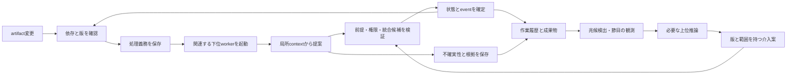

# 設計草案

状態: 2026-09-10。kernel、実Lunaによる局所修正と上位介入、8・16・32体の初期比較を検証した。永続化はC=1の専用runnerで実process再開まで確認済み。本文中の広い設計案と、末尾の実装済み境界を区別する。

現在の役割分担と規模比較は [現在の方針](current-direction.md) を参照。基礎資料は [調査レポート](references/raw--deep-research-sheep-agent-swarm-theory-20260909.md) の第5・7・9節。資料中の設計案は、現在の利用者の方針と区別する。

## 作業と観測の二つのループ

下位は局所作業と根拠の記録を続け、上位は通常の成果物・作業履歴を観測する。下位から上位への相談APIや、返答待ちを通常の作業手順に設けない。未解決の状態は保持し、解決可能な別の作業は進める。上位による全件承認は確定条件にしない。

初期workerと観測側の判断は固定出力の実験用関数とする。時刻、ID、順序、faultを外から与え、同じtraceを再現できるようにする。接続範囲のkernelの機械的性質を確認後、実worker4体＋上位1体、16体と8・32体の比較へ進む。永続化はその後に追加する。

## 状態の分離

| 対象 | 内容 |
|:---|:---|
| Artifact / Dependency | 版付き成果物と、consumerからproviderへの根拠付き関係 |
| Proposal / Validation | read set、write set、統合候補snapshot、受入条件と環境の版 |
| WorkClaim / AuthorityLease | advisoryな担当予約と、epochで失効できる変更権限 |
| Event / Obligation / Receipt | 変更の発生、処理が必要な対象、受信・処理の証拠 |
| EpistemicClaim | 観測、仮定、不足証拠、支持の組、blockingかどうか |
| Run / Audit | 目的・範囲・入力epoch・完了状態・運用介入・実験外からの救済・遷移履歴 |
| Intervention（設計上の追加候補） | 観測根拠、対象範囲、参照版、変更する作業条件、適用epochと期間 |

`Claim` の多義性を避け、予約はWorkClaim、判断や疑問はEpistemicClaimと呼ぶ。TypeScript型は [src/protocol.ts](../src/protocol.ts) の初期草案。Interventionや運用介入の履歴はまだ型に追加していない。既存の`Run.externalIntervention`を運用メタ管理の介入フラグとして流用せず、実装時に通常動作と実験外からの救済を分ける。wire formatはM1、永続schemaはM4で検証して決める。

## 不変条件

1. shared stateを確定する主体はkernelに限定する。
2. write対象だけでなく、観測したread setと権限の有効性も確定時に照合する。
3. テストを実行した統合候補と、採用するsnapshotを一致させる。検査中にbaseが進んだら再構築・必要な再検証をする。
4. state更新と対応event／obligationの記録に、crashによる取りこぼしを作らない。
5. 同一eventの再配送で二重確定しない。crash前のseenをhandledとして数えない。
6. 新しい依存の登録と現在版の照合を一体で扱い、既に発生した変更を拾う。
7. trueな依存は時間経過や過去のignoredだけで削除しない。
8. 訂正は現在の近傍だけでなく、古い根拠を消費した判断へも届く。
9. 未解決のblocking claimは、TTLや多数のdoneで消えない。
10. authority leaseの古いepochは、artifact版が同じでも確定に使用できない。
11. 全員idleだけでは成功としない。処理義務・proposal・retry・claim・受入証拠を同一状態で確認する。

in-memoryの条件はtests/kernel.test.tsとtests/kernel-fixture.test.tsで検証する。durabilityはC=1の専用runnerとSIGKILL再開試験で検証済み。並列runnerの再開は未対応。型草案や初期化時の3テストだけで全条件の成立を主張しない。

## 完了

runへの新規入力を区切ったepochについて、実行中の仕事、未配達／未処理の義務、未確定proposal、予定されたretryがないことを確認する。その上で、必要な影響範囲の証拠と対象snapshotの受入pass、blockingな疑問・競合の解決を要求する。

未知の依存を含む完全な影響範囲を、既知graphだけから保証することはできない。外側の受入テスト・検索・別系統の観測を用意し、把握している範囲を記録する。

## 上位による観測と介入

上位モデルのメタ管理が運用上の調整を担う。監視の常駐部分はプログラムで扱い、wait-for循環、進捗のない競合、反転を繰り返す変更、未解決作業の滞留、複数対象の不変条件などを観測する。通常のartifact循環だけでは起動しない。上位の役割は継続して存在してよいが、推論の起動頻度と各介入の範囲・期間を記録する。

下位の自己申告だけに依存せず、節目の全体確認や抜き取り確認も行う。上位は差分・検証結果・未解決点から読み、必要な証拠を追加で取得する。観測と読み直しを含めて計上する。

介入は共有仕様、例、制約、担当、優先順位、予算、続行可否へ反映する。上位も版・権限・受入条件の検査を通し、作業条件の変更は通常の変更eventとして必要な対象へ届くようにする。条件変更の影響を受ける提案や完了証拠を再評価し、失効した権限や前提での確定を拒否する。上位が参照した根拠も古くなり得る。

実験の外側の採点条件はrun前に固定する。上位が作業仕様を明確化しても、失敗を成功へ変えるための採点条件の緩和は行わない。

運用メタ管理の介入はシステムの通常動作で、その費用と効果を含めて評価する。人間や実験外のAgentからの救済は別に集計する。任意の評価用shadow observerは別の出力先へ記録し、runへ情報を戻さない。全情報を見るLLMも採点oracleにしない。

個体数N、最大同時実行数C、モデルの組、観測方針、予算上限はrun設定として残す。実際の稼働数と待ち時間も観測する。規模と対照の条件は [検証方針](testing-policy.md) に従う。

## 永続化と実コードへの接続

M1はin-memoryの決定論的モデル。M2で実workerを接続し、M3で人数を変えた挙動を観測する。この段階のcrash中断は未完了とし、継続やdurabilityを保証しない。M4でSQLite等の短いtransactionへstate・event・obligationを写し、crash/restart試験を行う。LLM実行中にDB transactionを保持しない。

Git branch更新とDB更新が一体で原子的に成功するとは仮定しない。immutableな候補objectを先に作り、DBで採用snapshot参照とeventを確定する案を検証する。linked worktreeは作業領域の分離に使えるが、OSのアクセス制御にはならない。

runtime schema、capability設定、外部副作用broker、複数snapshotのmerge、証拠の失効規則は未確定。実装時に小さな反例で条件を固定する。

## 実装で確定した境界

Docker Agent導入後もworkerの作業VMはkernelの権威を持たない。mountless VMへcheckoutから明示した内容だけを投入し、次のcallにsessionや私有filesystemを暗黙継承しない。局所toolは実ファイルを編集し、その全差分を候補として回収する。最終回答のreplacement文字列や可視テストの自己申告は確定証拠にしない。pilotの外側oracleも別の通信拒否VMで実行する。既存swarmへの接続はtool-less caller差替えまでで、一般repoのtool付与は別途設計する。[導入境界](docker-agent-sandbox.md)

実行APIはsrc/kernel.tsのSwarmKernel。checkoutが読取版と根拠epochを保持し、prepare→trusted verifierによるvalidate→commitで候補snapshotと権限を検査する。内容不変の訂正にも根拠epochを使う。依存登録は観測した内容版と根拠epochの両方から追いつく。完了検査のawait中に始まって終わった作業も、遷移世代の変化として拒否する。

上位は現在の仕様・APIと不変な失敗call/validation履歴を読む。修復中consumerの将来の内容に対する永続的な依存へ、過去の失敗観測を変換しない。仕様の訂正自体のread set検査は維持する。受入条件や実行環境の識別子はhostが保持し、上位の仕様変更では書き換えられない。

M4の実行系はsrc/durable-run.ts。SQLiteの世代比較と短いtransactionへkernel状態・outbox・呼出予約を保存し、保存失敗後のkernelをfenceする。復元時は旧leaseと未確定候補を失効させ、確定済みIDを保持する。同じartifactを新しい前提でnoop再検証することと、同じproposalの二重確定を区別する。

現行kernelは履歴を含む依存graphに対して保守的に根拠を失効させる。原案のsupportSetsによる最小のAND/OR証拠更新、外部副作用broker、任意repositoryのmerge、並列runのdurabilityを全て実装したものではない。上位の実介入は現在、共有仕様の変更に限定する。

比較fixtureの必須importは、固定oracleのNode子processで [SourceTextModule.moduleRequests](https://nodejs.org/api/vm.html#sourcetextmodulemodulerequests) を使って構文解析する。コメント上のimport文字列だけでは要件を満たしたと扱わない。値の等価性に加えて、このtaskで明示された依存維持条件も検査する。

中央管理の計画観測も不変snapshotとして保持する。計画を適用する直前に観測した全体のread stampsを検査し、仕様変更の継続的な依存は仕様/APIの文脈だけへ限定する。読んだ全文・版・入力量はcall receiptへ残し、読み直し費用を隠さない。広く読んだコードを全て仕様の将来の依存へ変換すると、workerの正当な修正が他のworkerの前提まで失効させることを実走で確認した。
