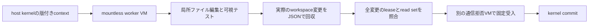

# Docker AgentとSandboxの導入

2026-09-10。Docker Agentはworker runtimeとして使い、割当・局所記憶・read set・lease・受入・確定はsheep-swarmに残す。`sub_agents`やhandoffで羊の制御を置換しない。

## 導入した構成

| 項目 | 固定値・境界 |
|:---|:---|
| Docker Agent | v1.137.0、公式releaseのSHA-256をhostとVM内で照合 |
| Docker Sandboxes | sbx v0.42.1、ローカルmicroVM |
| template | `docker/sandbox-templates:docker-agent@sha256:70b4bd213f644ec0e0d11621af84b26f406f6dc4155a0bf7dbefdc9d3c735de0` |
| 計算資源 | 呼出しごとに2 CPU・4 GiB。新規VM、新規session DB |
| workspace | mountless。明示的なファイル内容だけ投入、repoやGitをマウントしない |
| 外向き通信 | `chatgpt.com:443`だけ。既存allowがある環境は起動を拒否し、global policyを自動変更しない |
| 認証 | hostのCodex access tokenをsbx custom secret resolverからproxyへ。VMにはplaceholderのみ |
| SSH・MCP | SSH転送無効、sbx MCP registryが空であることを事前検査。Docker AgentにはMCP toolを渡さない |
| 局所道具 | filesystemの6 operationと、固定の`node --test visible.test.mjs`。汎用shell・Git・LSPは未公開 |
| 終了 | 正常・失敗・timeout・AbortSignalの後に自分のVMだけ削除。失敗時は停止も試み、成功にはしない |

template同梱のDocker Agentはv1.127.0だったため、起動後に検証済みv1.137.0を投入する。Node.jsはv22.22.1であり、host側のNode.js 24.12+という要件とは異なる。現pilotは`.mjs`のみ。任意のTypeScript repoをこのtemplateで実行できるとはしない。

## 準備

Node.js 24.12以上、macOS Apple Siliconまたは対応Linux/x64環境、認証済みCodex、sbxが必要。今回の実機検証はmacOS arm64のみ。

```sh
npm run sandbox:install
# docker agentコマンドも更新する場合。従来のpluginをbackupへ保持する。
node scripts/install-docker-agent.mjs --user-plugin
docker agent version
sbx version
sbx login
sbx settings set ssh.agentForwardingEnabled false
sbx daemon restart
```

このMacではsbxをHomebrewでv0.42.1へ更新済み。将来のsbxは挙動を確認してからpinを更新する。既存sandboxがある環境でのdaemon再起動は、進行中作業を確認して行う。

旧Docker Agent pluginは`~/.docker/sheep-swarm-backups/docker-agent`に保持する。Dockerのplugin探索ディレクトリにはbackupを置かない。

`scripts/docker-agent-token.mjs`はsbxがhost側で呼ぶresolverで、手動実行しない。stdoutは秘密値のため通常ログへ出してはいけない。既定では`~/.codex/auth.json`の有効なaccess tokenだけを読み、refresh tokenは読まない・コピーしない・更新しない。認証が期限切れならCodex側で更新する。resolver自身には自動refreshも別providerへのfallbackもない。非標準の認証保存先はdaemon側の環境設定を含めた追加対応が必要。

利用者は本導入のためのCodex認証のproxy利用を明示的に承認した。Sandboxには個別名のsecretのみ設定し、`sbx rm`でそのscopeも削除する。API費用への切替や別モデルへのfallbackは行わない。

## 実行

```sh
# LLMを呼ばず実microVMの隔離・削除・oracleを検証
npm run sandbox:probe

# Lunaが読み、失敗テストを実行し、編集・再検証する
npm run sandbox:pilot

# 既存swarmのtool-less workerをDocker Agentへ差し替える
npm run swarm -- --runtime docker-agent --workers 4 --concurrency 2 \
  --size 4 --max-calls 6 --max-meta-calls 0 --timeout-ms 120000
```

最後の例は4 consumerと1 reportを持つ既存fixture。登録4体は呼出し4回を意味しない。最大6呼出しの受付を与える。`--runtime`を省略すると従来のCodex adapterになる。`compare`・`mechanism`・`durable`は今回の切替対象に含めない。

`callDockerAgent`は既存のcaller interfaceに接続する。`files`を指定しない場合はcwdをコピーせず、prompt内contextだけで働く。局所道具を使うときは`tools: "local"`と`files`を明示する。JSON形式のYAML例は[configs/docker-agent-local.yaml](../configs/docker-agent-local.yaml)。`permissions`はconfigの最上位に置く。

## 候補をどう採用するか



pilotはモデルが最終回答に書いた`content`より実際に編集されたファイルを採用する。最終回答で末尾改行が省略されても、実ファイルの内容は保持する。全変更をlease検査へ渡し、許可外ファイルを黙って捨てて成功にしない。削除・symlink・特殊file・不正path・件数/容量超過は現adapterの対応外として拒否する。

可視テストはworkerが変更できるので、成功の証拠にはしない。pilotの独立oracleは新しい通信拒否VMで11ケースを検査し、null・undefined・Unicode・非stringの既存例外動作を確認する。固定oracleをworkerに渡さず、別VMを削除後にkernelへverdictを戻す。一般repositoryの安全な受入環境まで実装したものではない。既存swarm fixtureの受入方式は従来通りである。

## 記録と失敗

各呼出しは`.sheep/.../sheep-docker-call-*/receipt.json`に設定、入力ファイル、NDJSON、stderr、版、hash、sandbox名、各lifecycle操作、削除結果を保存する。timeoutでも既に届いたusageを残し、未完了の推論がある場合は`usageCompleteness: partial-or-unknown`とする。総費用0とは扱わない。

`token_usage.usage`は実測とv1.137.0のコードでは直近のcontext snapshot。消費量は各`last_message`のinput・cache read/write・outputから集計する。`budget_usage`を加算せず、同一usage eventの重複も拒否する。`last_message.Model`はruntimeの設定IDに由来するため`configuredModelEvidence`に残し、`effectiveModelEvidence`はnullとする。

Lunaのruntime価格は`unpriced`、costは0と表示された。これは無料の証明ではない。Docker Agentの`max_cost`はこの条件の費用上限に使わず、token上限・時間上限・外側の呼出し数で制御する。budgetはターン間の受付制御で、外側timeoutがVM削除を担う。既存価格表での集計や利用枠実測は別作業である。

`sandbox:pilot -- --response <保存済みresponse.json>`はモデル再呼出しなしで、保存済み候補を別VMで検査する。新しい結果には元ファイルのpath・hashを残す。元runを成功へ書き換えない。

hostプロセス自体のSIGKILLや電源断後の自動回収は未実装。残存名はreceiptのsandbox名で確認し、`sbx rm --force <その名前>`で個別削除する。`sbx rm --all`や`reset`は本導入の手順では使わない。VMのpool再利用、32台の同時起動、上位のSandbox内tool利用は未検証。

## 調査から修正した点と出典

- RuntimeとSandboxは別。VM外でtool permissionsだけに依存しない。[Headless](https://docs.docker.com/ai/docker-agent/guides/headless/)
- Clone modeでも元repoの未追跡・ignoredファイルが読める。局所性にはmountlessへの明示投入が適する。[Isolation](https://docs.docker.com/ai/sandboxes/security/isolation/)
- 既定のSSH転送、共有skills、hostで実行されるMCPは別の権限境界。今回の実版で共有workspace mountの不在とSSH不在を検査する。[Credentials](https://docs.docker.com/ai/sandboxes/configuration/credentials/)
- `restricted`とoperation制限は補助。固定test commandも編集したコードを実行するため、VM外では使わない。[Permissions](https://docs.docker.com/ai/docker-agent/configuration/permissions/)、[Script](https://docs.docker.com/ai/docker-agent/tools/script/)
- toolを使った最終JSONには`structured_output.mode: tool`を使う。[Structured output](https://docs.docker.com/ai/docker-agent/configuration/structured-output/)
- ChatGPT providerとSandboxの認証は自動で接続できると仮定せず、401から実確認した。[ChatGPT provider](https://docs.docker.com/ai/docker-agent/providers/chatgpt/)
- budgetは進行中turnを中断しない。未価格モデルのcost上限にも注意が必要。[Budget](https://docs.docker.com/ai/docker-agent/configuration/budget/)
- 固定した実装は[Docker Agent v1.137.0](https://github.com/docker/docker-agent/releases/tag/v1.137.0)と[sbx v0.42.1](https://github.com/docker/sbx-releases/releases/tag/v0.42.1)。
