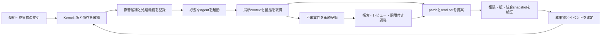

# 羊型Agent Swarm再検討 — 局所的に働き、訂正を届け、完了を確かめる

調査日: **2026-09-09（日本時間）**  
分析範囲: 元対話の整理、関連理論、先行研究の原典照合、最小構成と反証可能な評価設計。実Agentによる性能実験・製品の導入は行っていない。

原資料: `/Users/annenpolka/inbox/動物高等評議会の読み込み.md`。関連15対話の原文と整理は同梱の [抽出資料](raw--session-extract-sheep-agent-swarm-20260909.md) に収録した。本文の「原文○行」は、この原資料の行番号である。

## 要約

**羊型の有力な設計像は、成果物の依存を追跡する増分処理に、LLMによる修正提案と根拠の更新を組み込むことである。** 各Agentは必要な範囲だけを読み、共有状態への確定・通知・処理の回収を小さなkernelが担う。中央の意味判断を通常処理から減らす価値はあるが、単に通信を疎にしても正しさは得られない。

今回の再検討で優先した点は次の五つ。

1. **依存グラフを、仕事の前提として信じすぎない。** 欠落・古い版・意味上の制約を扱う観測経路が必要。
2. **訂正を、通知だけで終わらせない。** 根拠に依存した判断・レビュー・完了証拠を失効させる。
3. **claim・権限・commitを分ける。** 作業の予約は柔らかくても、反映時の版・権限・証拠の検査は必須。
4. **doneを、自己申告から検証可能な状態へ移す。** 通知の処理、未解決事項、同一snapshot上の検証を揃える。
5. **成功率を落として局所性を達成しない。** 単一Agentと効率的なManager型を基準に、同じ品質で総費用を減らせるかを見る。

元対話の最終判断に従い、既存製品からは設計を借りる。Agent Mail等を主要依存へ加えること、新規性の主張、独自の分散基盤の構築は前提にしない。

**確実性の区分:** 原文の抽出と論文・公開仕様の記述確認は「確認済み」。以下の羊型への適用は「設計上の推論／提案」。羊型が実際のコーディングで費用・品質・復旧性を改善するかは「未検証」。一部の理論的欠陥については、独自の小さな有限モデルで反例を確認した。

## 1. 何を実現したいのか — 「全部を知らなくても働ける」条件

元対話の目的は、Agentの認知範囲と影響範囲を局所化することにある。原文3181–3189行の「局所で問題を閉じられる」「個体の世界は、大きくしすぎない」が最も一貫した軸である。

これは「全体を見るものを一切置かない」という制約ではない。原文3644行では中央DBやevent busを許容し、全体を理解して次の仕事を決めるLLMとの区別を明示している。したがって、SQLite一つで全状態を保持していても、各Agentが局所的に動く構成は羊型の範囲に入る。

実用上の問いは、次のように絞るとよい。

> 変更の影響範囲が小さい仕事で、常時の意味的な取りまとめを省いても、品質を維持しながら必要なAgent・読み込み・再作業だけで完遂できるか。

「Managerを使わなかった」という形式を目的にすると、kernelの裏に巨大な分類LLMを置く、固定手順を手作業で大量に用意する、未検出の影響を無視する、といった見かけ上の達成が可能になる。人間の事前整理、graph構築、検索、再試行、監査も費用に数える必要がある。

**原文の判断の優先順位。** 5917行で利用者は学術的新規性よりcoding agent／skillとしての実用性を重視し、6728行では既存製品の全面採用から有用なアイデアの借用へ修正している。途中の製品推奨を最終決定として再掲しない。

## 2. 誰が何を知り、何を決めるのか

羊型の主体はAgentだけではない。成果物、検証器、実行機構、人間の仕様判断を含めて責任を分ける必要がある。組織上の役名や動物のキャラクターは固定Agentへ直訳しなくてよい。

| **要素** | **必要な情報** | **決めてよいこと** | **成果物** |
|:---|:---|:---|:---|
| 利用者／仕様の責任者 | 目的、受入条件、変更範囲 | 要求の意味、受け入れる振る舞い | 版付きの要求・契約 |
| 作業Agent | 担当成果物、依存証拠、今回の変更、関係する制約 | 調査・修正案・不確実性の提示 | patch、観測、読んだ版の一覧 |
| Kernel | 版、権限、依存、未処理イベント、検証結果 | 定義済みの規則に従うroutingと反映 | 確定状態、配送記録、監査ログ |
| Reviewer | 対象変更、契約、検証証拠 | 意味上の適合性を評価する提案 | 版付きレビュー結果 |
| Coordinator | 解消できない部分問題と境界契約 | 当該範囲の解決案 | ADR、共同patch案、未解決点 |
| Referee | 実行記録と固定された採点条件 | timeout、採点、実験状態 | 評価結果 |
| Shadow Observer | 許された時点までの全体情報 | 診断・仮説を記録 | runへ戻さない診断ログ |

**Ownerには二つの意味が混ざっている。** 誰が仕事を引き受けるかという担当と、誰に変更を確定する権限があるかは異なる。担当を移しても権限が自動で増えないようにする。一つのartifactに複数人が提案できても、確定は一貫した規則で行える。

**Kernelにも設計判断は入る。** 「runtimeは意味を考えない」（原文3788行）は、実行時のLLM判断を置かないという意味なら妥当である。ただし、何をartifactと見なし、何をテストし、何を危険な変更と判定するかは、設計者が先に決めた意味を含む。規則を版付きで記録し、その作成・変更費用も評価する。

## 3. 直接効く仕組み — 自由会話から、変更と証拠の受け渡しへ

通常処理を、次の一周として定義する。



API schemaの変更なら、まずschemaの版差分を通知し、そこに依存するclientやテストに処理を発生させる。全文の会話履歴を配る必要はない。一方、「field renameはdocsだけに影響」といった判定には根拠が要る。構文上の差分だけで意味の互換性まで確定できるとは限らない。

**PatchBoardの確認。** 2026年5月のプレプリントは、Architectがschema・worker contract・workflowを作り、deterministic kernelがJSON Patchを検証・確定する構成を示す。ALFWorldの126 gamefiles × 5 seedsでは成功率84.6%。比較した1k／2k／4k **characters**では最小contextが最良の成功・費用関係を示した。一方、False Claimの受理は残る。これは構造化された状態遷移の先例であり、任意のrepoでの正しさや「contextは常に小さいほどよい」の証明ではない。[PatchBoard §3–5、Appendix B](https://arxiv.org/html/2605.29313v1)

ここから借りるのは、**LLMの提案と共有世界の確定を分けること**である。task固有のblueprintを全面生成する方式を、そのまま採用する必要はない。

## 4. 成立する背景条件 — 局所性はタスクの性質に依存する

羊型に向くのは、成果物の依存が比較的明確で、受入条件を局所・境界ごとに検証できる作業である。変更が全体へ波及する仕事を無理に局所化すると、読み込みを減らした分だけ欠落が増える。

| **仕事** | **見込み** | **局所性を成立させる条件** |
|:---|:---|:---|
| 小さなAPI修正とclient追従 | 高い | consumerと生成元を追跡できる |
| package内の不具合修正 | 高い | 契約と回帰テストがある |
| docs・生成物の同期 | 高い | 生成元・対象範囲・版を特定できる |
| 複数packageにまたがる契約変更 | 中程度 | 境界ごとの証拠と統合snapshotを持つ |
| 全体の命名・認証モデルの刷新 | 低いことがある | 共有判断を先に成果物化し、必要な同期を払う |
| 要求が曖昧な新規機能 | 不明 | まず仕様と責任境界を確定する |

この表は設計上の予測であり、実測による順位ではない。

### 4.1 近傍を三段階に分ける

元対話5774–5831行の分離をさらに明確にする。

- **潜在影響範囲:** 依存・共有制約から見て、今回の変更の影響を受けうるartifact／担当。
- **実際の起動対象:** cheapな検査で除外できなかった、または調査が必要な担当。
- **実際に読むcontext:** 各呼び出しで投入した本文・差分・証拠。

潜在範囲が広くても、機械的な互換性検査で多くを処理できればLLM呼び出しは少なくできる。逆に近傍Agentが一体でも、そのAgentが巨大なglobal contextを読むなら局所性は達成していない。

### 4.2 羊型は全体通信の費用を消せない

**独自の反例。** 二つの世界を考える。世界Aにはschemaの隠れたconsumerが存在しない。世界Bには存在するが、その依存edgeと発見可能な証拠が局所観測から欠けている。作業Agentの観測履歴が同じなら、両世界を確実に区別して異なる正解を選ぶことはできない。

従って、未知の依存の発見には、検索、実行時の依存記録、別系統のテスト、周期的な広域確認、人間への仕様照会など、追加情報の入口が必要である。「分からなければuncertainを出す」だけでは、**分からないことに気づけない失敗**は防げない。

ここから得られる設計条件は、常時全体を読ませることではなく、**局所観測で区別できない状態を、どの追加観測で区別するかを定義すること**である。

## 5. 構造を決める — Agentの組織図より、依存と制約のモデル

### 5.1 一つのグラフにすべてを混ぜない

最小でも次の関係を区別したい。同じDBに持つことは構わない。

| **関係** | **例** | **使い道** |
|:---|:---|:---|
| 成果物の依存 | client は schema から生成される | 影響伝播、再実行 |
| 判断の根拠 | レビュー結果は schema@v2 と test@h に依存する | 訂正時の失効 |
| 担当・権限 | Agent Aはclientを担当し、許可範囲へ提案できる | 起動と反映境界 |
| 複数対象にまたがる不変条件 | producerとconsumerの互換性 | 調整範囲、統合検証 |

Agent間の通信graphは、この関係から導出する補助的なviewでよい。artifactが多数のconsumerを持つ場合、Agentへ投影したgraphは密になる。**artifact経由にしただけでは疎性は保証されない。** 大きなschemaの内部を契約単位に分けるか、互換性検査を挟むか、広域変更として受け入れる必要がある。

また、何でもpairwise edgeにすれば十分とは限らない。「A・B・Cの組み合わせでのみ守る制約」は、制約オブジェクトに参加artifactの集合を持たせる方が明瞭である。Coordinatorの範囲は、その制約が参照する境界まで含める。

### 5.2 依存を見つける入口と、有効期限

静的import、生成設定、schema reference、テスト対象、実行時に読んだファイルを機械的な発見の入口にする。設計判断や文書の関係はAgentが候補を出し、証拠を添える。

```text
Dependency:
  consumer, provider, relation
  evidence_ref, discovered_by
  observed_consumer_version, observed_provider_version
  validity_condition
  status: supported | suspect | retired
```

**真の依存に、単純な時間TTLを適用しない。** 依存を参照するコードが変わらなければ、時間が過ぎただけで関係は消えない。TTLで期限切れにするのは検査の鮮度、担当者の予約、起動の最適化情報などである。依存の失効は、根拠や対象版の変更と結びつける。

原文6872–6894行の `ignored` 学習も同様である。「この版差分はfield未使用なので無関係だった」と、「今後schemaに依存しない」は別の判断。前者から後者へ飛躍してedgeを削ると、次の必須field変更を取りこぼす。最初は依存を保ち、差分型に条件づけたskipの証拠だけを蓄積する。

### 5.3 新しい依存を登録するときの取りこぼし

単に `subscribe(X)` を追加するだけでは、Xが直前に更新された場合に通知を逃す。**依存登録と現在版の照合を一つの整合した操作にし、未観測の版があれば処理義務を作る。** 同様に、反映された変更とイベント生成の間にcrashしても取りこぼさないようにする。

ここが、skill文面だけで「必要な相手に知らせる」と書く方式と、検証可能なprotocolとの違いになる。

## 6. 長期的な文脈 — 羊型を支えるのは、複数の古い問題の解き方

この構想は、生物の群れという比喩だけでは十分に説明できない。関連理論の役割を分けると、借りるべき部品が見える。

| **系譜** | **扱ってきた問題** | **羊型で借りる部分** |
|:---|:---|:---|
| 自己安定化（1974） | 異常状態から正常な状態へ戻る条件 | 復旧性を雰囲気でなく性質として定義する |
| Truth Maintenance（1970年代） | 仮定が崩れたとき判断を訂正する | 根拠と判断の依存を保持する |
| 分散終了検出（1980） | 全員が止まって見える時、本当に終わったか | 未処理メッセージと仕事の回収 |
| 分散snapshot（1985） | 実行中に全体の一貫した状態を観測する | 監査と検証の対象版を固定する |
| Gossip membership（2000年代） | 全membershipを知らずに伝播経路を維持する | 近傍の修復と別経路の観測 |
| CALM／I-confluence（2010年代） | どの処理には同期が必要か | 追加的な証拠収集と、確定・排他を分ける |
| 増分ビルドの体系化（2018） | 依存変化に応じて必要なものだけ再計算する | dependency trace、再実行、schedulerの分離 |
| LLMの状態・通信研究（2025–2026） | 曖昧な会話による誤りと調整費用 | 構造化提案、局所context、失敗の測定 |

年は各代表文献の年であり、その分野の誕生年を断定するものではない。詳細な出典と適用範囲は次節で示す。

## 7. システムの基本原理 — 局所性を保証に近づける

### 7.1 増分ビルドと、LLMによる再計算の違い

『Build Systems à la Carte』は、何を再実行するかというrebuilderと、依存順序をどう処理するかというschedulerを分離し、動的依存も扱う体系を提示する。変更された入力から必要箇所を再計算する発想は、羊型との接点が強い。[Mokhov・Mitchell・Peyton Jones, 2018](https://www.microsoft.com/en-us/research/wp-content/uploads/2018/03/build-systems.pdf)

**羊型への適用案:** artifactをキー、版を値の識別子、Agentの仕事を「前提が変わったときの再評価」とみなす。ここで必ず再生成する必要はなく、「今回の変更では既存出力が有効」という証拠を更新できればよい。

ただしLLMの出力は、同じ入力から常に同じ結果になるとは限らない。再利用条件には、読んだartifact版だけでなく、要求版、model／prompt／tool設定、外部情報の鮮度、検証器の版も関係する。

```text
再利用可能性のキー候補:
  仕事の目的 + 入力artifactの版 + 要求・契約の版
  + 実行設定 + 検証設定 + 外部観測の有効条件
```

これは完全な関数キャッシュの証明ではなく、古い成果を無条件に使い回さないための提案である。環境依存が不明なら、再観測の必要を明示する。

### 7.2 CALM — 追加は容易でも、「もう何もない」は容易でない

CALMは、一定の分散計算モデルの下で、単調な論理で表現できるプログラムに整合したcoordination-free実装が存在することを特徴づける。ここでいう単調性は、入力情報が増えても既に得た結論を取り消す必要がない性質である。任意のLLM出力の正しさや、コードpatchの安全性を保証する定理ではない。[Hellerstein・Alvaro, Keeping CALM](https://arxiv.org/abs/1901.01930)

**羊型への推論:** 「Agent Aが版vで疑問qを提出した」という記録は、後で疑問が解消しても過去の事実として追加的に保持できる。一方、「この変更には未解決の疑問が一件もない」「影響先はすべて終わった」という判定は、後から来る情報で覆りうる。

従って、通常時は観測・提案・訂正履歴を追加的に集め、確定時には対象run、対象版、必要な処理集合について情報が揃ったことを確認する構成が自然である。**履歴がappend-onlyでも、現在の結論が単調になるわけではない。**

### 7.3 I-confluence — 別々に正しい変更を、合わせてもよいか

I-confluenceは、共通祖先から到達した不変条件を満たす状態をmergeした際にも、その条件を満たすかを調べる。論文のモデルと前提の下では、coordination-freeな正しい実行が可能かを特徴づける。コード変更へ直接定理を適用するには、状態・操作・merge・不変条件の定義が必要である。[Bailisほか, Definition 6・Theorem 1](https://www.vldb.org/pvldb/vol8/p185-bailis.pdf)

**独自の反例:** 二つの認証手段A・Bのどちらかが有効ならよいとする。初期状態は `A=1, B=1`。Agent AはBが有効だと読んでAを無効化し、Agent BはAが有効だと読んでBを無効化する。各提案は自分のsnapshotでは条件を守り、書き込み対象も異なる。両方を反映すると `A=0, B=0` になる。

ここでは、**書いたファイルのbaseVersionだけの検査では足りない。** 両提案が読んだ前提まで検査するか、統合候補上で「最低一方式有効」という不変条件を検査する必要がある。

この反例を有限モデルで実行した。各Agentのread→commit順を守る全6順序のうち、書き込み対象の版だけを検査する方式では4順序で条件を破った。観測した全read setの版も検査する方式では0順序だった。これは小さな構成例の全列挙であり、実障害率や一般的な安全性の証明ではない。

なお、常に中央化が必要という結論でもない。不変条件によっては、識別子の名前空間を分ける、有限資源の利用権を先に分割するなど、操作や権限の設計を変えて同期を減らせる。羊型の目標は、全体制約を無視することではなく、局所で守れる形へ変換できる範囲を見極めることである。

### 7.4 Truth Maintenance — 訂正を「読ませる」から「失効させる」へ

DoyleのTruth Maintenance Systemは、判断の理由を記録し、後から仮定と矛盾する発見があった時に信念を更新する仕組みである。単なる会話履歴保存より、何を根拠に何を信じたかを残す発想が重要になる。ここでは1979年論文の公開abstractと著者の書誌を確認した。[論文abstract](https://www.sciencedirect.com/science/article/pii/0004370279900080)、[著者の文献一覧](https://groups.csail.mit.edu/medg/people/doyle/publications/)

**羊型への適用案:** `uncertain` を一つのstatus値に閉じず、版付きの判断オブジェクトとして扱う。

```text
Claim:
  claim_id, subject, subject_version, proposition
  observed_evidence[], assumptions[], missing_evidence[]
  support_sets[]
  status: open | supported | contested | superseded
  supersedes?, resolution_evidence?
```

たとえば「nullableでよい」というレビューが `schema@v2` を前提にしていたなら、schema訂正時にそのレビューをstaleにする。さらに、そのレビューを根拠にした `done` 証拠も再検証対象へ移す。

複数の独立した根拠がある場合、一つが失効しただけで結論が必ず誤りになるわけではない。根拠の組ごとに有効性を再計算し、未確認・失効・反証を区別する。自然言語の根拠リンク自体が誤っている可能性もあるため、完全自動の真理判定にはしない。

**訂正の配送先は、現在の近傍だけでは足りない。** 既にその判断を消費したAgent・提案・検証記録にも届く必要がある。古いconsumerへの訂正経路は、短期的なrouting最適化で削除してはいけない。

### 7.5 Stigmergyとgossip — 環境を介すことと、意味上の依存は別

SBPの公開仕様には、減衰するsignalであるPheromone、永続するTrace、条件に応じたwake-upを登録するScentがある。環境に痕跡を置き、それに別Agentが反応する先例として借りられる。[SBPの操作・概念](https://github.com/AdviceNXT/sbp)

HyParViewは、小さなactive viewとより大きなpassive viewで伝播経路を維持・修復するmembership protocolである。近傍そのものを更新する設計は参考になるが、ランダムpeerの発見と「このAPIに依存するclient」の発見は異なる問題である。[HyParView §4](https://joaoleitao.org/pdf/HyParView.pdf)

**羊型への適用案:** signalの配送ヒントは再生成可能でも、未処理の仕事や未解決の疑問は永続化する。減衰させてよいのは「起こす優先度」であり、「問題が存在する」という記録ではない。古い通知を捨てても、現在版と観測済み版の照合から必要な処理を再作成できるようにする。

### 7.6 自己安定化 — 復旧した経験と、必ず復旧する性質

Dijkstraの自己安定化は、許された遷移規則の下で、初期状態にかかわらず有限回の遷移で正当な状態へ到達する性質を扱う。単に一度復旧できたことより強い概念である。[Dijkstra, EWD426](https://www.cs.utexas.edu/~EWD/transcriptions/EWD04xx/EWD426.html)

羊型にこの名称を使うなら、まず正常状態、fault model、schedulerの公平性、許された復旧操作を定義しなければならない。LLMが自由にpatchを生成する系へ、そのまま収束保証を移せない。

最初に狙えるのは、Agent crash・重複通知・古い提案・依存欠落など、列挙した故障に対して回復すること。そして、回復できない場合にも無限に予算を消費せず `blocked` として停止することである。**停止できることと、要求を達成して収束することは別の評価にする。**

### 7.7 終了検出 — 全員がdoneと言っても終わっていない

Dijkstra–Scholtenは、仕事を伝播する計算に付随する終了検出を扱い、メッセージと対応するsignalの負債を回収する。各processの停止だけでは、途中のメッセージから仕事が再発生する可能性が残る。[Termination detection for diffusing computations](https://www.cs.utexas.edu/~EWD/transcriptions/EWD06xx/EWD687a.html)

**羊型への推論:** `seen` は受信の証拠にすぎない。`handled` も「この通知に対する処理を終えた」であり、run全体の成功とは限らない。Agentが未解決claimを提出してそのターンを終了することはある。

```text
静止していること:
  実行中の仕事 = 0
  未配達・未処理の処理義務 = 0
  未確定proposal・再試行予定 = 0

成功していること:
  静止 + 対象版の受入条件がpass
  + 必要な影響範囲の処理証拠が揃う
  + blockingな疑問・競合が未解決でない
```

これを一貫した状態として読み取る必要がある。非同期の別時点の「全部0」を足し合わせてはいけない。Chandy–Lamportは実行中の分散系のglobal stateを記録する問題を扱う。[Distributed Snapshots](https://www.microsoft.com/en-us/research/wp-content/uploads/2016/12/Determining-Global-States-of-a-Distributed-System.pdf)

最初の単一DB実装なら、複雑な分散snapshot protocolを移植せず、対象runへの新規入力を区切ったepochとDB transaction内の状態確認で始められる。継続運転する系ではシステム全体の永遠の終了ではなく、run／変更waveの終了を判定する。

### 7.8 Lease — 期限は、古い実行主体を止める魔法ではない

期限付きlockは、process停止や遅延によって失効後も古い所有者が処理を続けうる。Kleppmannは、保存先が単調増加するfencing tokenを検査し、古い所有者の書き込みを拒否する必要を説明している。[How to do distributed locking](https://martin.kleppmann.com/2016/02/08/how-to-do-distributed-locking.html)

**羊型への適用案:** 二種類に分ける。

- **作業claim:** 重複作業を減らすためのadvisory情報。無効でも提案を保持してよい。
- **実行権限のlease:** Coordinatorの決定の確定、write capabilityなど。kernelが現在のholder・期限・epochを反映時に検査する。

独自の反例として、旧Coordinatorの期限が切れ、新Coordinatorへepoch 2が発行されたが、artifactはまだ同じ版のケースを考えた。旧Coordinatorのepoch 1の提案はbaseVersion検査を通る。従って権限の失効を実現するには、**版が一致していても権限epochを別に検査する**必要がある。

終了条件も `until resolved` だけでは不十分である。「解決するまで」は期間の上限ではない。絶対期限、更新条件、最大延長、引継ぎ先を定義し、未解決のまま期限切れなら安全に引継ぐか停止する。

### 7.9 循環・相関・振動 — 多数のAgentを独立した証拠と数えない

依存graphに循環があること自体は、行き詰まりを意味しない。相互に参照するmoduleや反復処理は普通にありうる。Coordinator起動条件には、wait-forの循環、同じ変更の反転、進捗がない再試行、跨る制約の競合などを使う。

「APIを変える→clientが戻す→APIが戻す」の振動を防ぐには、まず目的と契約の版を揃える。さらに同一原因の通知の集約、既処理イベントのdedup、再試行回数の上限、エスカレーションのcooldownを導入する。ただし疑問を消して見かけの進捗を作らない。

同じmodel、同じ誤ったschema、同じ要約を見た五体の賛成は、五つの独立観測ではない。必要なのは、別の証拠源、異なる検査方法、反例テストである。MASTもmulti-agentの失敗をsystem design・inter-agent misalignment・task verification等へ分類しており、単に人数を増やす評価から先へ進む材料になる。[Why Do Multi-Agent LLM Systems Fail?](https://arxiv.org/abs/2503.13657)

## 8. 元対話の先行研究を照合する

### 8.1 何が確認でき、何を言い過ぎていたか

**SILO-BENCHの確認。** 論文は30種類の算法課題を3段階に分け、2–100体、P2P・Broadcast・Shared FSで評価する。報告対象のLevel IIIでは **N ≥ 50** で成功率0%となる。Table 4の早期提出37.2%、合意失敗29.9%、計算誤り28.6%は**重複する分類**で、相互排他的な失敗原因の割合ではない。これは自由な情報統合の困難さを示すが、羊型や現在の全modelの性能を測った結果ではない。[SILO-BENCH §4–5・Tables 3–4](https://aclanthology.org/2026.acl-long.1354.pdf)

**AgentNetの確認。** Agentごとのrouter／executorと、経験に応じた接続更新を持つ先例である。論文の初期状態はfully connectedで、最初からartifact依存に沿って疎に起動する構成とは違う。今回は論文を確認したが、元対話にある `Experiment.solve_a_single_task()` 等の実装評を再監査したわけではない。[AgentNet §3・§5.3](https://arxiv.org/html/2504.00587v2)

**SwarmSysの確認。** Explorer／Worker／Validatorを使い、agentとeventのprofileの対応や強化による協調を扱うプレプリントは実在する。動的な仕事発見の参考になるが、repoのartifact依存の正確な追跡とは別の仕組みである。[SwarmSys](https://arxiv.org/abs/2510.10047)

| **元対話の主張** | **今回の扱い** |
|:---|:---|
| PatchBoardが構造化提案と限定contextを実証 | 論文内の評価として確認。repo改修への一般化は未検証 |
| SILO-BENCHは「50を超えると0%」 | 対象条件では50以上。失敗割合は重複分類である点も補足 |
| AgentNetの分散routingは羊型に近い | 近さはあるが初期はfully connected。元対話5535行もこの点を認めている |
| Agent Mailのleaseで安全に排他できる | advisory予約と強制的な権限・commit保証を分ける |
| Rust版の評価リンク | `quangdang46/mcp_agent_mail` はfork。上流と識別する |
| 個別repoの公開で「実務に確立済み」 | 公開実装の存在と普及・成熟度は別。横断的な実用優位は未確認 |
| 部品を組めばskill一枚で十分 | 実行基盤が保証を既に提供する場合に限る |
| 羊型は成功率より近傍数が重要 | 成功品質を先に固定し、その上で近傍・費用を最適化する |

Rust Agent Mailのリンク先がforkであることはGitHubの表示で確認した。上流は別repoである。元対話の個別version、issue番号、stress数値、A／B評点を、今回の現況評価として引き継いではいない。[元対話で参照したfork](https://github.com/quangdang46/mcp_agent_mail)、[上流Rust版](https://github.com/Dicklesworthstone/mcp_agent_mail_rust)

### 8.2 実務から借りる設計は、どこまで揃っているか

以下は公開文書・skillの確認であり、各製品をインストールして耐障害試験した結果ではない。

| **先例** | **公開情報で確認した部品** | **羊型での利用判断** |
|:---|:---|:---|
| [MCP Agent Mail](https://github.com/Dicklesworthstone/mcp_agent_mail) | identity、非同期mail、file/globのadvisory lease | identity、期限付き予約、履歴をcontext外へ置く考え方を借りる |
| [SBP](https://github.com/AdviceNXT/sbp) | ephemeral signal、durable trace、条件起動 | 通知と持続する知識を分ける。未解決事項を減衰させない |
| [x0x-symphony](https://github.com/saorsa-labs/x0x-symphony) | 共有backlog、claim、isolated workspace、署名付きhandoff | 自分でclaimする運用の先例。CRDTやネットワーク基盤は最小案に不要 |
| [symlock](https://github.com/echoVic/symlock) | tree-sitterによるsymbol境界とclaim | 必要なら予約の粒度を細かくする。ただし意味上の競合は残る |
| [agent-ledger / agent-relay](https://github.com/sean2077/agent-ledger/blob/main/skills/agent-relay/SKILL.md) | 公開artifactの追記型共有台帳、訂正の参照 | 再開可能なartifact交換と訂正履歴を借りる |
| [Cursor pluginsのswarm skill](https://github.com/cursor/plugins/blob/main/pstack/skills/swarm/SKILL.md) | 親がworkerを展開し、待ち、集約する手順 | fan-out/fan-in型の具体的な比較対象 |

「swarmと呼ぶskillはすべてManager型」とまでは言えない。この例では親による集約が明示されている、という確認に留める。同様に、今回「羊型全体が一般的な標準になっている」とする根拠は得られていない。

元対話のWaymark、Pact、Codespaces、CAWS、GTD、AMAS、TopoDIM等は、抽出資料に候補として保存した。今回は採用根拠にせず、個別の保守状況・強制力・benchmarkを確認済みと扱わない。

## 9. アイデアだけを借りる最小設計

ここからは**本調査による提案**であり、実装済み仕様ではない。最初の動作範囲を「単一ホスト、既存repo、3–4 worker、局所的な変更、外部副作用なし」に限定する。modelや既存Agent製品を固定する必要はない。

### 9.1 最初に持つ状態

元対話の6テーブル案に、正しさを評価するための情報を補う。最初から11個の独立tableへ分ける必要はないが、概念を失わないことが重要である。

| **状態** | **最低限保持する情報** |
|:---|:---|
| Run | 目的、scope、受入条件の版、入力epoch、予算、状態 |
| Artifact | ID、kind、immutable content参照、現在版 |
| Dependency | 方向、関係、証拠、有効な版・条件 |
| Ownership / Capability | 担当と許可範囲。予約と分離 |
| Event | ID、原因ID、run、artifact版、種別、永続seq |
| Obligation | どの変更を、誰が／どの役割が処理する必要があるか |
| Receipt | seen／handled／ignored、理由、対象版、証拠 |
| Proposal | base snapshot、read set、write set、patch、根拠 |
| Claim | 不確実性、観測、仮定、欠けた証拠、解決・訂正関係 |
| Lease | 対象、役割、holder、期限、authority epoch |
| Validation / Audit | 検証したsnapshot、テスト定義・環境の版、結果、遷移履歴 |

追加状態が多く見える理由は、最終案の `done` や `lease` に圧縮されていた意味を分けたためである。UIやネットワーク機構を増やす必要はない。

### 9.2 通知と処理義務

小さなsignalは、本文の代わりに参照を持つ。

```json
{
  "event_id": "ev-102",
  "run_id": "run-7",
  "kind": "changed",
  "artifact_id": "api/schema",
  "from_version": "h1",
  "to_version": "h2",
  "cause_id": "proposal-31",
  "evidence_ref": "validation-31"
}
```

Kernelは依存から対象を求め、`(event_id, consumer, contract_version)` 等をキーに処理義務を記録する。Agentのcrash後にもこの記録から再実行できる。少なくとも一度の配送と重複排除で開始してよいが、重複したLLM実行による異なる提案を「同じだから」と黙って上書きしない。

`seen` は配送確認、`ignored` は影響なしとした理由付き判定、`handled` は処理の終了とする。処理終了時に未解決claimが作られた場合は、runのblockingな義務が別に残る。claimがないから成功なのではなく、**必要な証拠が揃ったから成功**とする。

### 9.3 確定時の検査

```text
1. 提案を構文・schema検証する
2. 現在のcapabilityと、必要なauthority leaseを確認する
3. 読んだ前提・変更対象・依存根拠の版を照合する
4. 最新snapshotへ提案を適用した統合候補を作る
5. 境界契約と必要なテストを、その候補に対して実行する
6. 候補作成時のbaseがまだ現在であることをCASで確認する
7. 現在snapshot参照・新規event・処理義務を一体で確定する
8. baseが進んでいたら再構築・必要な再検証へ戻す
```

SQLiteはtransactionと直列化されたwriteを提供する。しかし、LLMがtransaction外で読んだ前提を、自動で検証してくれるわけではない。長いLLM実行中にDB transactionを保持する構成は避け、短い確定区間で明示的に前提を検査する。[SQLiteのisolation](https://www.sqlite.org/isolation.html)、[transactionの動作](https://www.sqlite.org/lang_transaction.html)

**GitとDBの二重確定に注意する。** Git branch更新とSQLite更新は、単純には一つの原子的transactionにならない。最小案では先にimmutableなGit object／snapshotを作り、DB側の「採用snapshotへの参照」とeventを同時確定するなど、どちらを正とするかを一つに決める。branchへの反映を派生操作にすれば、crash後に再構成できる。これは設計案であり、Gitを使えば自動で得られる保証ではない。

### 9.4 worktreeと権限境界

worktreeは作業ディレクトリを分ける道具として便利である。一方、linked worktreeはrepositoryの共通情報を共有し、それだけでOS上のアクセス制御境界にはならない。[git-worktree公式文書](https://git-scm.com/docs/git-worktree.html)

従って、Agentが自由なshellを使える構成で「自分のworktreeしか書けない」を保証したことにはしない。最初の検証ではworkerからproposalを回収し、shared stateの採用はkernelだけが行う。直接アクセスまで制約する必要があれば、sandbox・権限・tool broker側で実現する。

### 9.5 Coordinatorと監査を最小化する

調整役は、未解決なclaimや競合の集合を受け取り、解決案を成果物へ出す。常設の全体担当にしない一方、「常設は悪」とも決めつけない。毎回ほぼ全体を集めて同じ調整をしているなら、その仕事は局所分割に向いていない可能性がある。

監査は次の二つを分離する。

- **運用中のauditor:** 欠落や矛盾を検出してsignalを出す。これはシステムの能動的な一部なので、費用と効果を数える。
- **評価用shadow observer:** runへ情報を返さない。比較・診断用の別経路である。

「命令しないが、必要な依存先を教える」observerは、既にrunを助けている。権限がないことと、情報的な介入がないことは同じではない。

### 9.6 skillが担うところ、コードが担うところ

| **skill／Agentへの指示** | **kernel／実行基盤** |
|:---|:---|
| 目的・担当範囲を守る | capabilityとscopeを反映時に検査 |
| 必要なcontextを要求する | 読み込み量・版・参照を記録 |
| patchと根拠を構造化して返す | schema・base・read set・テストを検証 |
| uncertainを省略しない | claimを永続化し、完了と区別 |
| 競合の解決案を出す | lease、epoch、失効、再試行を処理 |
| 局所で処理できない理由を示す | 完了条件と予算を機械的に判定 |

skillは作業方針を与えられるが、プロンプトだけでCAS、crash後の配送、権限失効を強制できない。既存基盤にそれらがあれば薄く組み合わせ、なければ最小のhelperを置く。まずこの境界を固定する方が、新たなframeworkを選ぶより判断しやすい。

## 10. どの実験なら、この構想を支持・反証できるか

### 10.1 比較する対象

元対話のManager／Broadcast／Sheep比較に、単一Agentと強いManager基準を加える。

| **方式** | **構成** | **比較する理由** |
|:---|:---|:---|
| 単一Agent | 同じtool・受入条件で逐次実行 | 小さな仕事ではこれが最安かもしれない |
| Manager-local | Managerが担当を選ぶが、workerは局所contextを取得 | context最適化と分散判断の効果を切り分ける |
| Sheep-fixed | artifact依存routing、固定graph | 動的発見を除いた基準 |
| Sheep-full | 動的依存発見、claim伝播、期限付き調整 | 構想全体を評価 |
| Broadcast | 全体contextと広域通知 | 読み込み増幅の診断用。主たる勝敗相手にはしない |

同じmodel・version、tool権限、最大同時実行数、総予算、テスト、最終受入条件を使う。Manager側も必要なときだけ読む最適化を許す。羊型だけ事前に正しい依存を与えたり、Managerだけ不必要な全文を読ませたりしない。

graph作成やcontext抽出に費用がかかる場合、初回と繰り返し利用時を別に示す。providerのprompt cache等も使った量と費用を分ける。

### 10.2 順番に試す

**段階A: protocolだけ。** 固定worker出力で、重複・逆順配送・crash・古い提案・lease更新・依存登録の競合を再現する。recorded traceのreplayは、LLMを再呼び出す再実行とは区別する。

**段階B: 小さな実コード。** 4–6 package、3–4 worker、API schema変更から始める。生成元、client、テスト、無関係packageを含める。受入テストを先に固定し、関係する箇所だけ直るかを観察する。

**段階C: 誤った地図。** 依存を一つ欠落させる、生成設定を移す、古い版を通知する、意味上の制約だけを跨がせる。発見できない場合に、最後の検証で失敗と分かるかも評価する。

**段階D: 規模。** 無関係なpackage／担当だけを増やす場合と、変更のfanout自体を増やす場合を分ける。前者でcontextが増えないことは、後者でも一定費用で済むことを意味しない。

最初の数件は不具合発見用のpilotとし、効率改善の断定に使わない。その後、調整に使っていないtask・repoと複数seedへ広げ、同一taskのpaired比較と不確実性区間を示す。taskごとのばらつきが大きいため、token総量だけを無関係なrun間で比較しない。

### 10.3 先に固定する反例と採点条件

| **ケース** | **入れる故障／変更** | **期待する観測** |
|:---|:---|:---|
| 局所変更 | 無関係packageが多数ある | 無関係workerのLLM呼び出しが不要な範囲で抑えられる |
| 未知依存 | generated clientのedgeを除く | 発見して再検証するか、受入失敗として検出する |
| 静かな意味変更 | 型は同じ、単位だけ変更 | 型検査だけで成功としない |
| 古い読み込み | 読んだschemaが提案中に更新 | stale提案を拒否／再観測する |
| write skew | 別artifactを別々に変更 | 組み合わせの不変条件を守る |
| 重複配送 | 同一eventを再配送 | 未処理は再開、処理済みは二重確定しない |
| 受信後crash | seen後にAgent停止 | handledとして誤計上しない |
| 期限切れ | 古いCoordinatorが復帰 | 失効した権限で確定できない |
| 不確実性 | claimを未解決で放置 | TTLや多数のdoneで消えない |
| 訂正 | 過去に消費された根拠を訂正 | 依存するレビュー・doneが再検証される |
| 無害な循環 | 相互依存するが進捗あり | 循環だけで不要な調整役を呼ばない |
| 振動 | 同じ二案を交互に反映しようとする | 検出して調整／停止。無限再試行しない |
| 途中の通知 | 全Agent idle、未配達eventあり | 全体成功を宣言しない |
| 近傍の誤削除 | 前回はignored、今回は影響あり | 前回の無影響から依存自体を消さない |

これらを検査できるようにしてから実LLMの挙動を調べる。hardな機構の不具合と、意味判断の失敗を同じ「Agentが迷った」にまとめない。

### 10.4 成功と効率の指標

成功率を主制約に置く。その上で費用・時間・局所性を比較する。品質の許容差や費用目標は、pilot前に用途に応じて決める。ここでは結果を見てから有利な閾値を選ばないという原則だけを固定し、実証根拠のない数値目標は置かない。

| **軸** | **測り方** |
|:---|:---|
| 完遂 | 固定受入テスト、scope遵守、未解決事項、統合snapshotの一致 |
| 自律性 | 事前に定義したprotocolのみで完遂した比率。外部介入を別記録 |
| 総費用 | worker、routing用LLM、Coordinator、発見、再試行、検証を含む費用 |
| 呼び出し量 | 総LLM calls、入力／出力tokens、Agent別合計 |
| context局所性 | 呼び出し単位の最大・p95入力、読んだ固有artifact数 |
| 通知局所性 | 変更ごとの潜在影響先数、実起動数、ignored率、取りこぼし |
| 復旧 | 故障から検出・回復までの時刻と費用、影響したartifact数 |
| 調整負担 | Coordinator呼出率、寿命、再開数、扱った範囲 |
| 訂正性能 | 無効根拠の消費者へ届く遅延、未再検証の判断数 |
| 人間の負担 | 前処理、仕様補足、手動介入、環境準備の時間 |

`active context / potential neighborhood` は、token数とnode数をそのまま割ると意味が曖昧になる。contextはtokens、起動率は対象Agent数同士、証拠量はartifact数同士で計測する。graph密度だけを改善して実contextを巨大化させる抜け道を防ぐ。

### 10.5 局所性の費用仮説

以下は測定値ではなく、比較時に費用を落とさないための概算式である。

```text
Sheepの総費用 ≈
  各起動Agentの推論・読込・tool費用の和
  + 依存発見 + 検証 + 再試行 + Coordinator
  + 運用中の広域監査 + 基盤の準備・維持
```

変更に関係するAgentがk体、平均の局所処理費がcなら、通常処理部分は概ね `k × c` に近づくことを期待する。ただしkが全体規模Nとともに増えれば費用も増える。全体schema変更、共有の大きな制約、頻繁なCoordinator起動はこの期待を崩す。

羊型が支持されるのは、**品質を保った上で、実際の影響範囲に費用が追従する**場合である。無関係なAgentを増やしただけで強い効率を主張しない。

### 10.6 Meta Managerを「oracle」にしない

原文4471–4475行では全contextを見るMeta Managerをoracleと呼んでいる。しかしLLMは全情報を見ても誤る。次の三者を区別する。

1. **採点器:** 固定された機械的受入条件と、必要なら独立した人間の評価。
2. **全情報baseline:** 全contextを見るAgentが実際に解けたか。
3. **Shadow診断:** 途中の何を問題だと予測していたか。

Shadow診断は時点ごとに保存し、未来のログを見た事後分析と区別する。「step 4なら気づけた」という主張は、その時点での記録がなければ検証できない。方式間のstepは仕事量が異なるため、token使用量・壁時計時刻も添える。

Observerの助言をrunに渡した場合は `external_intervention=true` として別集計する。一方、事前に定義した条件で起動する内部Coordinatorは羊型protocolの一部であり、単に起動しただけで外部介入とはしない。起動率と費用は必ず報告する。

## 11. 結論と次の判断

**この構想は、実装して確かめる価値がある。ただし成否を決めるのは、Agent間の会話の巧さより、依存の発見・証拠の失効・処理の回収・確定境界である。**

最初に借りる設計は、Agent Mailのidentity／advisory claim、SBPの通知と永続知識の分離、PatchBoardの提案と確定の分離、増分ビルドの依存追跡、Truth Maintenanceの訂正伝播でよい。個々の製品を連結して同じ機能を何重にも持つ必要はない。

**直近の試作:** 最小のartifact graph、durable event／obligation、proposal validator、claim、版付き検証結果を定義する。単一processで故障を再現し、その後に既存coding agentをworkerとして接続する。

**その次:** 小さなrepo上で単一Agent・Manager-localと比較する。既存の高品質なbaselineに対して、成功率、費用、復旧性のどこが改善したかを見る。勝たない場合は、graph構築費用、検査粒度、共有制約の広さを分析する。

**規模を広げる条件:** 実験で待ち時間・耐久性・同時実行がボトルネックだと分かってから、queueやDBの分散を検討する。年数によるロードマップより、この観測された条件を導入判断に使う。

最も重要な未解決点は三つ残る。自然言語の契約依存をどこまで正確に追えるか。依存発見と全体検証を含めても費用が下がるか。Agentが気づかない誤りを、現実的な検証予算でどこまで捕捉できるか。今回の文献調査と有限モデルは、これらの実用上の問いにはまだ答えていない。

## 12. 主要資料と確認範囲

外部資料の参照日はすべて2026-09-09。リンク先の公開文書は後日変わりうる。本文の近くにも、当該主張を支える直接リンクを置いた。

| **資料** | **確認範囲** |
|:---|:---|
| [Build Systems à la Carte（2018）](https://www.microsoft.com/en-us/research/wp-content/uploads/2018/03/build-systems.pdf) | 論文本文。動的依存、schedulerとrebuilder |
| [Keeping CALM（2019）](https://arxiv.org/abs/1901.01930) | 論文のabstract・定理の位置づけ |
| [Coordination Avoidance in Database Systems（2014／VLDB 2015）](https://www.vldb.org/pvldb/vol8/p185-bailis.pdf) | 論文本文、I-confluenceの定義と前提 |
| [A Truth Maintenance System（1979）](https://www.sciencedirect.com/science/article/pii/0004370279900080) | 公開abstract。書誌は著者サイトでも照合 |
| [Termination Detection for Diffusing Computations（1980）](https://www.cs.utexas.edu/~EWD/transcriptions/EWD06xx/EWD687a.html) | 著者アーカイブの本文 |
| [Distributed Snapshots（1985）](https://www.microsoft.com/en-us/research/wp-content/uploads/2016/12/Determining-Global-States-of-a-Distributed-System.pdf) | 論文公開資料の問題設定 |
| [Self-stabilizing Systems（1974）](https://www.cs.utexas.edu/~EWD/transcriptions/EWD04xx/EWD426.html) | 著者アーカイブの本文・定義 |
| [HyParView（2007）](https://joaoleitao.org/pdf/HyParView.pdf) | 論文本文、active／passive viewと修復 |
| [How to Do Distributed Locking（2016）](https://martin.kleppmann.com/2016/02/08/how-to-do-distributed-locking.html) | 著者の解説、leaseとfencing |
| [PatchBoard（2026、v1）](https://arxiv.org/html/2605.29313v1) | 本文、context感度、fault injection、評価設定 |
| [SILO-BENCH（ACL 2026）](https://aclanthology.org/2026.acl-long.1354.pdf) | 本文、agent規模、失敗分類の重複 |
| [AgentNet（2025、v2）](https://arxiv.org/html/2504.00587v2) | 本文、router／executor、初期graph |
| [SwarmSys（2025）](https://arxiv.org/abs/2510.10047) | 論文と公開abstract。導入試験なし |
| [Why Do Multi-Agent LLM Systems Fail?（2025）](https://arxiv.org/abs/2503.13657) | 公開abstractとfailure taxonomy |
| [SQLite isolation](https://www.sqlite.org/isolation.html)・[transactions](https://www.sqlite.org/lang_transaction.html) | 公式仕様 |
| [Git worktree](https://git-scm.com/docs/git-worktree.html) | 公式仕様、共有repository情報 |
| 第8節の各OSS・skill | README／SKILL.mdとrepo系譜。実行・負荷試験なし |

元対話の個別issueの詳細、主観評点、star数、普及度を示す言葉は、今回の結論の根拠に採用していない。今回の有限モデルは独自に作成した反例であり、上記論文の実験結果ではない。

## 付録A. 再現可能な有限反例

次のPython 3コードは、二つの提案が別の対象を更新する場合を、許される全6スケジュールで列挙する。入力、スケジュール、判定は固定。外部依存やAPIは不要である。

```python
from itertools import permutations

def preserves_invariant(order, check_all_reads):
    value = {"x": 1, "y": 1}
    revision = {"x": 0, "y": 0}
    proposal = {}
    for who, phase in order:
        own, other = ("x", "y") if who == "A" else ("y", "x")
        if phase == "read":
            proposal[who] = (dict(revision), value[other] == 1)
        else:
            base, wants_write = proposal[who]
            checked = ("x", "y") if check_all_reads else (own,)
            if wants_write and all(revision[k] == base[k] for k in checked):
                value[own] = 0
                revision[own] += 1
    return value["x"] + value["y"] >= 1

actions = [("A", "read"), ("A", "commit"),
           ("B", "read"), ("B", "commit")]
orders = [p for p in permutations(actions)
          if all(p.index((a, "read")) < p.index((a, "commit"))
                 for a in ("A", "B"))]
print("schedules:", len(orders))
for mode in (False, True):
    violations = sum(not preserves_invariant(p, mode) for p in orders)
    print("check_all_reads:", mode, "violations:", violations)
```

今回の実行結果:

```text
schedules: 6
check_all_reads: False violations: 4
check_all_reads: True violations: 0
```

棄却後の再試行やLLMの判断はモデル化していない。read set検査によるこの反例の防止だけを確認している。未知の読取依存、queryのphantom、外部状態、複雑な不変条件への一般化には追加の検証が要る。

ほかに、失効後もartifact版が同じならbaseVersionだけでは旧権限を拒否できないこと、局所観測が同一の二世界では隠れた依存の有無を区別できないこと、全Agentがidleでも未配達eventがあれば静止と判定できないことを、明示した構成例として検討した。これらはLLMの性能測定ではない。

## 付録B. 原資料と保存

- 原資料SHA-256: `8f0712d7a51b6cd616910f062ec72f81f9d53b738a7793ab5fb108ea825b044e`
- 抽出資料: `raw--session-extract-sheep-agent-swarm-20260909.md`
- 本レポート: `raw--deep-research-sheep-agent-swarm-theory-20260909.md`
- 保存先: `/Users/annenpolka/Mechachang/raw/`
- Codexで閲覧するため、同一内容をこのtaskの `outputs/` にも配置する。
- 元資料と既存rawは変更していない。wikiへのingest、commit、pushは本調査の対象外。
