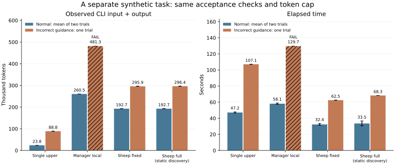

# 単体・中央管理・局所Swarmの比較

2026-09-10 JST。[集計JSON](comparison-v2.json)、[実験CLIの使用量台帳](model-usage-ledger.json)、[実行時ソース](frozen-runtime-sources.zip)。M1〜M3で使わなかった温度/圧力の合成taskに対し、通常2回と誤指示1回を4方式で実行した。

結果は、通常条件が全方式で2/2成功。誤指示条件は単体上位と2種のSheepが成功し、中央管理は未完了だった。中央管理の初期実装不具合を修正した[追加試行](manager-observation-fix.md)でも、通常2回は成功し、誤指示1回は予算内で完了しなかった。単体上位のtoken消費が最も少なく、Sheepの所要時間が短かった。この一種類・少数試行で一般的な優位を結論しない。

## 共通条件

APIを℃/kPaからK/Paへ変更し、sensor8個と、離れたsensorを組み合わせるregion2個を修正する。regionの公開単位は℃/kPaのままで、単純な名前置換では通らない。固定の外側oracleが数値、物理的閾値、境界、出力キー、必須importを実Nodeで検査する。ライブラリは固定し、各方式が採点器を変更する権限は持たない。

単体上位はAstra。複数Agent方式はLuna4体・C=4とAstraを使う。全方式に同じ編集可能artifactと最終受入を与え、単体上位にも部分patchの局所確定を許す。Managerは上位が次の担当を選択し、Sheepはhostの局所的な割当規則で進め、意味的な失敗を観測した上位が共有仕様へ介入する。

1runあたり500,000token、呼出48回、対象3試行、24round、1呼出90秒を上限とした。開始時に30,000token分を予約し、返却された全使用量で精算する。予約はproviderへの強制上限ではない。単体上位の誤指示試行では1呼出が予約量を超えたが、run全体は88,804tokenで上限内だった。上限超過や使用量不明は比較の成功にしない。

Sheep-fixedは既知graph、Sheep-fullは実ファイルのimport/仕様宣言を走査してgraphを構築する。後者は通常条件で11走査・121ファイル読取、誤指示条件で12走査・132読取を記録した。走査自体は各runで1ms未満だったが、これは小さな静的fixtureでの値であり、任意の意味依存を発見できる証拠ではない。

## 通常条件

| 方式 | 成功 | 平均秒 | 下位 / 上位呼出し（各run） | 平均入出力token |
|:---|:---:|---:|---:|---:|
| 単体上位 | 2/2 | 47.17 | 0 / 1 | 23,832 |
| Manager-local | 2/2 | 58.10 | 10 / 3 | 260,548 |
| Sheep-fixed | 2/2 | 32.36 | 10 / 0 | 192,651.5 |
| Sheep-full（静的発見） | 2/2 | 33.54 | 10 / 0 | 192,733 |

SheepはManagerの3回の全体読取・割当を省き、このtaskでは所要時間とtokenを減らした。ただし単体上位は1呼出しで全10ファイルを修正したため、Sheepのtoken消費は約8.1倍だった。小さな局所呼出しごとにCLIの付帯contextも入力されるため、渡したコードの短さだけで効率を評価できない。

## 誤った共有指示からの復旧

全方式の初期仕様へ、sensorの測定値を整数へ切り捨てる同じ誤指示を入れた。外側oracleは小数を要求するまま固定した。

| 方式 | 最終受入 | 秒 | 下位 / 上位呼出し | 再試行 | 入出力token |
|:---|:---:|---:|---:|---:|---:|
| 単体上位 | pass | 107.10 | 0 / 2 | 1 | 88,804 |
| Manager-local | **未完了** | 129.66 | 17 / 6 | 9 | 481,263 |
| Sheep-fixed | pass | 62.51 | 14 / 1 | 4 | 295,894 |
| Sheep-full（静的発見） | pass | 68.30 | 14 / 1 | 4 | 296,415 |

Sheepは最初の4候補が拒否された後、上位1回の仕様変更を介して通常の下位作業へ戻った。下位からの相談、上位の全件承認、採点条件の緩和は使っていない。単体上位は失敗証拠を受けた2回目に仕様とコードを修正した。単体の仕様変更は通常の実装patchであり、Sheepのmeta介入件数と同じ指標へ数え替えていない。

Managerの失敗もそのまま残す。下位17callの内訳は丸め拒否4、stale-read拒否9、確定4で、通信失敗はなかった。上位がglobal checkoutから仕様を書いたため、仕様がsensorの将来の編集へ逆依存し、1個のsensorの確定が他のworkerの前提を失効させた。stale候補9件は局所oracleなら全て通る出力だった。

上位6呼出し・仕様変更2回に進んだが、sensor2/3/5/6とregion2個が未完了だった。sensor2/3/5は3試行の上限にも達していた。最後の上位計画後、残りtokenが18,737となり、次の30,000token予約を満たさず停止した。元reportのadmissionDenied:falseはこの切詰め分岐で記録されなかった値であり、残予算と実行分岐から停止理由を補足している。

これは当該比較実装の観測依存の広さ、訂正の遅延、試行上限、予約粒度が重なった失敗で、中央管理一般の限界ではない。初期の失敗を保存したまま、観測snapshotと仕様の継続的な依存を分離し、同じ条件で追加比較した。修正後も誤指示試行は未完了だったが、原因と残った作業は分けて[追加記録](manager-observation-fix.md)へ示す。上の表と図は元の12runを保持している。

## 予備実行と検証境界の修正

先行したcomparison-v1は予備記録へ分離した。独立レビューで必須importの受入漏れと単体上位の増分確定制限を見つけ、仕様に沿う検査を追加し、全方式を修正版で実行し直した。M3で発見した回復済みCLI応答の誤分類も修正済み。予備runのモデル消費を消さず、台帳でm5-preliminaryとして別に計上する。

ここでいう別taskはM1〜M3との分離である。初期予備実行とハーネスの修正を含むため、完全に手つかずの外部benchmarkや盲検評価とは呼ばない。本比較のモデル出力を見ながらoracleやpromptを成功へ寄せる変更は行っていない。

## 費用と適用範囲

tokenは全役割・再試行・上位の読み直しを含むCLI使用量。通貨換算はせず、モデル間で同じtoken単価とも仮定しない。したがってtoken上限を揃えた比較であり、同じ金額の費用実験ではない。作業領域準備、context作成、走査、受入のruntime時間も保存したが、これらは一部重なるため単純合算しない。

fixture・oracle・既知graph作成や開発Agentの作業費用は計測対象外と明示する。台帳は保存された実験CLIレシートの範囲であり、開発全体の総費用ではない。途中で停止した予備dispatcherの下で、既に開始した子試行が自然終了した分も台帳に含む。

今回確認できたのは、小さな局所作業がLunaで成立し、共有指示の訂正を上位がまとめて行う構成を比較可能にできたこと。次は長い変更連鎖、途中の仕様変更、未知の意味依存、個体記憶と近傍選択の対照を持つtaskが必要になる。
