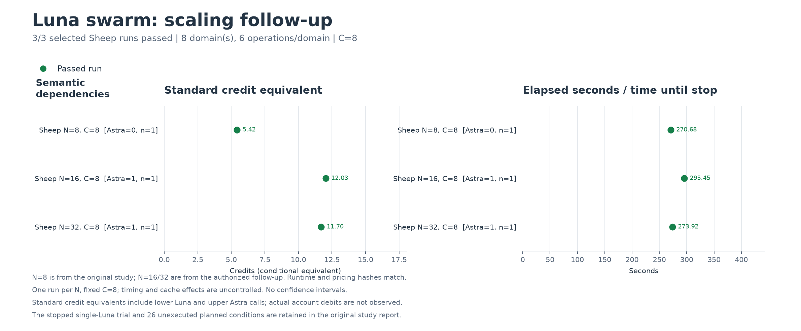

# Luna群れの機構実験 — 2026-09-10

Lunaによる局所修正、公開資料の追加読取、3段階の仕様変更は実際に動いた。48モジュールは8・16・32体とも成功し、C=8では所要時間が4分半〜5分弱だった。各1回の観測で、増員による明確な利点は見えていない。費用差には、16・32体で各1回生じたAstraの介入が大きく影響した。小規模な段階更新では単独Lunaのほうが安く短時間だった。

本試行は28条件を計画したが、2条件目の単独Lunaが90秒でタイムアウトし、使用量の最終通知を取得できず停止した。26条件は元の実験では未実行のまま保存し、失敗として成功率の分母へ入れない。利用者の承認により、費用不明の1呼出しを保持したまま、追加100クレジット相当の別系列で16・32体を各1回実行した。

## 48モジュールでの人数比較

意味依存課題を使用する。8領域×6種類のAPI、Luna下位、Astra上位、C=8、各試行30 Standardクレジット相当、呼出し上限400、1呼出し90秒、各対象の修正3回・追加読取2回という条件を揃える。runtimeと価格表は、元の8体試行から同一の22ファイルであることを確認する。

| N | 品質・完了 | 秒 | 呼出し | うち追加読取 | 1個体の実呼出し | 上位呼出し | credits相当 |
|---:|:---|---:|---:|---:|:---|---:|---:|
| 8 | 成功 | 270.7 | 134 | 86 | 16–17 | 0 | 5.420717 |
| 16 | 成功 | 295.4 | 139 | 88 | 8–9 | 1 | 12.031761 |
| 32 | 成功 | 273.9 | 138 | 87 | 4–5 | 1 | 11.697456 |

全条件で登録個体全員が参加し、最大同時呼出数も8だった。追加読取関係はN8が96本、N16が98本、N32が88本。既存ローダーの保持や追加の参考ファイルの読取を許しているので、この本数は「真の依存網を何割発見したか」という指標ではない。

| N | 下位Luna費用 | 上位Astra費用 | 上位の費用比率 |
|---:|---:|---:|---:|
| 8 | 5.420717 | 0 | 0% |
| 16 | 5.708761 | 6.323000 | 52.6% |
| 32 | 5.373206 | 6.324250 | 54.1% |

下位の費用は近い値だった。人数と費用の関係を論じるには、上位の介入回数、キャッシュ、読取・再試行の揺れを分ける必要がある。

各条件は1回の予備観測である。元の主試行と追加系列を跨ぎ、追加系列は16→32の順で実行した。時刻・キャッシュ・モデル応答の揺れを制御した反復比較ではなく、人数による因果効果や統計的優位を判定する資料にはならない。

## 上位介入を詳しく見る

N16では、domain-01のcacheが存在しない `event.timestamp` を参照して失敗したが、Lunaの局所再試行が `event.time` へ直し、開始56.371秒で解消した。その後domain-05で同じ誤りが出ると、累計2回の意味的失敗を契機に173.367秒からAstraが呼ばれた。Astraはcache/windowの式を共有指針に明記し、domain-05は209.243秒で修正された。

最初の失敗は、上位が呼ばれる約117秒前に解消済みだった。コードと記録から再構成した上位の観測対象は、当時未解消だったdomain-05だけになる。元の指針にも `time/value` と規範仕様の優先は書かれていたため、「上位が誤った仕様を修復した」「上位が不可欠だった」とは言えない。観測できたのは、共有指針の具体化と、その後の完了である。上位なし対照は未実行。

N16の費用内訳は、読取要求88回が3.384647、採用修正48回が2.233504、棄却修正2回が0.090610、Astra1回が6.323000 credits相当だった。上位callはinput 23,832 tokens、cache read 0で、費用のうち5.958が入力、0.365が出力に対応する。

指針の変更後にはhostで48件の再検証が走り、30件の既に正しい対象を追加のモデル呼出しなしで再受理した。次のworker開始まで3.244秒だった。次の介入条件では、累計失敗数に加え、現在残っている同種の誤り・局所再試行の停滞・影響範囲を比較する価値がある。

## 小規模な予備試行

開発v3は1領域6モジュール。SheepはN4/C4、単独方式はN1/C1。段階更新は3段階で、すべての下位呼出しにLunaを指定した。

| 課題・方式 | 結果 | 呼出し | 秒 | credits相当 |
|:---|:---|---:|---:|---:|
| 静的・Sheep | 成功 | 6 | 28.8 | 0.666705 |
| 意味依存・Sheep | 成功 | 15 | 65.3 | 1.257905 |
| 段階更新・Sheep | 3段階成功 | 26 | 131.2 | 1.592458 |
| 段階更新・単独Luna | 3段階成功 | 3 | 98.5 | 0.285941 |
| 段階更新・単独Astra | 2段階成功、3段階目の予約不可 | 2 | 97.1で停止 | 16.500500 |

Sheepの段階更新は14→7→5呼出しで各段階を完了し、26呼出し中22回で私有履歴が渡された。上位の呼出しは0だった。単独Lunaは約5.6分の1の費用で、約25%短時間で完了した。ただし各1回・異なるCでの小規模な予備比較であり、一般の開発作業への費用優位を示さない。

Astraは16.5005を使用した後、残り13.4995では次の15の予約が入らなかった。次の呼出しの実費がその範囲に収まった可能性はあるが、実行していない。これは誤答や実費超過を観測した結果ではない。

## 停止と使用量不明

本試行2条件目の単独Lunaは、1回目の呼出しが90秒でSIGKILLされ、`turn.completed` とusageを得られなかった。記録には開始イベントとCLIの診断のみがある。対応するsessionファイル、読み取り専用で確認したstate/log DBにも、使用量を復元する証拠はなかった。

この1件は費用不明として残す。返答内容も得られていないため、原因をcontextの長さ、モデルの能力不足、通信・提供側の停滞のいずれかと断定できない。48モジュールの単独Lunaとの費用・完了時間比較は成立していない。

元のdispatcherは予算規則どおり停止した。追加系列は利用者が新たに承認した100相当の枠であり、過去の既知費用と不明分をその枠へ混ぜない。追加系列で新しい使用量不明が起きた場合も停止する。

## 費用の範囲

追加比較前の開発v1/v2/v3と本試行を合わせると194呼出し、うち193件の使用量が確定している。公開Standardレート換算の既知下限は **34.666011 credits相当／API USD 1.38664044相当＋不明1呼出し**。完全な総額や上限は確定できない。

承認された追加系列は277呼出しで使用量が全件確定し、**23.729217／100 credits相当**、API USD 0.94916868相当だった。今回全体は **471呼出し、既知下限58.395228 credits相当／API USD 2.33580912相当＋不明1呼出し**。過去の費用を追加100の枠に二重計上していない。

キャッシュ読取は入力の内数、reasoningは出力の内数として二重計上しない。公開レートからの条件付き換算であり、実際の請求額、購入クレジットの引落し、Pro利用枠の消費率ではない。実装・調査を行った開発Agentや本対話の費用は含めず、実験として呼んだモデルのみを集計する。要求モデルは記録できたが、提供側が出した実効モデル識別の証拠は取得できていない。

## 実行前後に直した実行器の問題

- 開発v1は、CLIの「スキル説明を短縮した」という診断をtool操作と誤分類した。Astra1呼出し8.2735相当を残し、既知の診断種別を区別した。監査不能な不正イベントや出力量超過は停止させる。
- 開発v2は静的Lunaが成功した後、未使用の集計スクリプトの更新をsource固定の検査が検知して停止した。6呼出し0.668285相当を保存した。
- 単独モデルは既に正しいファイルも編集できる契約なのに、pending集合外の再提案を試行上限として拒否していた。固定callerの反例で修正し、実際の試行回数・権限・可視検査は維持した。
- 終了理由を明示し、予約不足、試行上限、最終品質、protocol、使用量不明を区別した。通常の未知使用量停止を弱めず、承認済みの追加系列だけを限定して実装した。

## ここから言えることと、次の課題

局所修正と履歴を持つ個体への割当は動作する。単独Lunaは必須の比較対象であり、小さい課題では群れの追加読取や呼出し回数が費用を増やした。上位を呼ばずに完了した条件では、上位介入の有効性を評価できない。

今回の意味依存は、公開カタログ・レジストリ・JSONポリシーの読取である。既存の動的ローダーを保持するだけで資料の値を読まずに正しく実装できる場合もある。各段階ではhostが全編集対象の完了義務を作るため、成功は「影響先を未知の依存から発見できた」という証拠にならない。

次は、変更された資料から影響先を見つける必要がある課題と、単独方式のtimeout・使用量保存を先に整える。3段階のN比較、私有記憶なし・上位なしの実モデル対照、総記憶量を揃えた対照、外部リポジトリの保留課題は未実行として残す。個体はIDと直近4件の観測を引き継ぎ、CLIセッション自体は毎回ephemeralである。Nを増やすと全体の記憶容量も増えるため、その効果を分離する対照が必要になる。

## 再現資料

- [実行方法と各制限](../mechanism-experiment.md)、[実行計画](../execplan-mechanism.md)
- [開発v1](mechanism-dev-v1-summary.json)、[開発v2](mechanism-dev-v2-summary.json)、[開発v3](mechanism-dev-v3-summary.json)
- [全5系列の費用範囲](mechanism-accounting.json)
- [元の主試行](mechanism-study-v1-summary.json)、[主試行のtoken別費用台帳](mechanism-study-v1-costs.json)
- [追加系列](mechanism-scaling-followup-v1-summary.json)、[追加系列の費用台帳](mechanism-scaling-followup-v1-costs.json)、[N比較の数値と出典](mechanism-worker-comparison.json)
- [実行時ソースZIP](frozen-mechanism-sources.zip)、[作図コード](../../scripts/plot-mechanism.py)、[SVG](mechanism-worker-comparison.svg)

実行時ソースZIPは903,541 bytes、SHA-256 `cf90dbf8b74541e8076c37ed96428adf9749c9d62a945baab25d74792b3a76b7`。元repoの `7fa6b4f1dbcd90661504892091c60f38c302fb1c` に選んだ系列の `source/` を重ねる。参照資料と `experiments/` は元repoから供給する。検証は型、220テスト、2つの参照ハッシュ、差分、JSON、文書リンク、画像の視認を含む。

生のレシート、個体メモ、kernel状態はローカルの `.sheep/` に保持する。公開集計は自由記述・絶対パスを除き、結果とレシートのSHA-256を保持する。凍結ソースは再実行用であり、モデルの同一出力や完全なOS読取隔離を保証するものではない。
