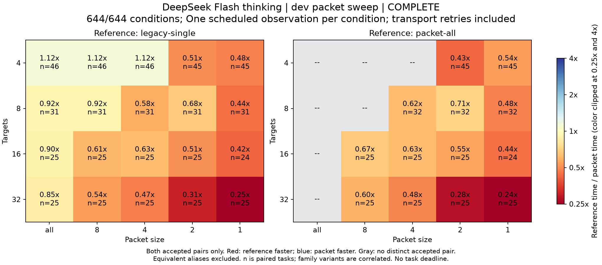

# dev packet粒度比較 — 全条件完了

凍結dev128課題、全644/644条件を処理した。同値条件を共有した644条件に対し、通信再試行を含む実試行は655回。DeepSeek Flash・thinking有効・上位0・packet最大C4・task締切なし。[事前方針](../packet-sweep-retry-plan.md)。

## 品質

| 方式 | 成功/観測 | 既知token下限（共有観測を含む） | 総tokens |
| --- | ---: | ---: | ---: |
| legacy-single | 127/128 | 1503990 | 1503990 |
| packet-all | 128/128 | 1703696 | 不明 |
| packet-8 | 128/128 | 3281004 | 不明 |
| packet-4 | 128/128 | 5577452 | 不明 |
| packet-2 | 128/128 | 10725504 | 不明 |
| packet-1 | 127/128 | 18138747 | 不明 |

方式別消費は同値条件を共有するため合計しない。成功品質と使用量の完全性は別の指標。

## packet-allとの時間比較

同一課題で両方式が成功した組を使う。手動停止と親の検証負荷が重なった2条件を除外し、その他の通信再試行時間・待機を含める。

| 比較先 | 両成功組 | 同値除外 | 参照が速い | 比較先が速い | 参照/比較先 時間比中央値 |
| --- | ---: | ---: | ---: | ---: | ---: |
| legacy-single | 127 | 0 | 60 | 67 | 1.08 |
| packet-8 | 50 | 78 | 37 | 13 | 0.60 |
| packet-4 | 82 | 46 | 64 | 18 | 0.59 |
| packet-2 | 127 | 0 | 101 | 26 | 0.50 |
| packet-1 | 126 | 0 | 109 | 17 | 0.43 |

## legacy-singleとの時間比較

同一課題で両方式が成功した組を使う。手動停止と親の検証負荷が重なった2条件を除外し、その他の通信再試行時間・待機を含める。

| 比較先 | 両成功組 | 同値除外 | 参照が速い | 比較先が速い | 参照/比較先 時間比中央値 |
| --- | ---: | ---: | ---: | ---: | ---: |
| packet-all | 127 | 0 | 67 | 60 | 0.93 |
| packet-8 | 127 | 0 | 76 | 51 | 0.86 |
| packet-4 | 127 | 0 | 85 | 42 | 0.74 |
| packet-2 | 126 | 0 | 100 | 26 | 0.50 |
| packet-1 | 125 | 0 | 100 | 25 | 0.39 |

## family別: packet-allとの時間比較

| 区分 | 比較先 | 両成功組 | allが速い | 比較先が速い | all/比較先 時間比中央値 |
| --- | --- | ---: | ---: | ---: | ---: |
| apportion | legacy-single | 16 | 9 | 7 | 0.97 |
| apportion | packet-8 | 6 | 5 | 1 | 0.60 |
| apportion | packet-4 | 10 | 8 | 2 | 0.49 |
| apportion | packet-2 | 16 | 13 | 3 | 0.49 |
| apportion | packet-1 | 16 | 14 | 2 | 0.34 |
| baseconv | legacy-single | 16 | 7 | 9 | 1.13 |
| baseconv | packet-8 | 6 | 4 | 2 | 0.87 |
| baseconv | packet-4 | 10 | 7 | 3 | 0.81 |
| baseconv | packet-2 | 16 | 12 | 4 | 0.75 |
| baseconv | packet-1 | 16 | 12 | 4 | 0.56 |
| dedup | legacy-single | 16 | 5 | 11 | 1.16 |
| dedup | packet-8 | 6 | 4 | 2 | 0.64 |
| dedup | packet-4 | 10 | 9 | 1 | 0.53 |
| dedup | packet-2 | 16 | 14 | 2 | 0.35 |
| dedup | packet-1 | 16 | 14 | 2 | 0.27 |
| intervals | legacy-single | 16 | 10 | 6 | 0.90 |
| intervals | packet-8 | 6 | 3 | 3 | 0.70 |
| intervals | packet-4 | 10 | 8 | 2 | 0.46 |
| intervals | packet-2 | 16 | 13 | 3 | 0.30 |
| intervals | packet-1 | 16 | 15 | 1 | 0.22 |
| stats | legacy-single | 16 | 2 | 14 | 1.27 |
| stats | packet-8 | 6 | 5 | 1 | 0.59 |
| stats | packet-4 | 10 | 8 | 2 | 0.57 |
| stats | packet-2 | 16 | 12 | 4 | 0.75 |
| stats | packet-1 | 16 | 12 | 4 | 0.58 |
| topk | legacy-single | 16 | 8 | 8 | 1.06 |
| topk | packet-8 | 6 | 4 | 2 | 0.63 |
| topk | packet-4 | 10 | 8 | 2 | 0.38 |
| topk | packet-2 | 16 | 15 | 1 | 0.24 |
| topk | packet-1 | 15 | 14 | 1 | 0.26 |
| units | legacy-single | 15 | 10 | 5 | 0.84 |
| units | packet-8 | 8 | 7 | 1 | 0.64 |
| units | packet-4 | 12 | 7 | 5 | 0.93 |
| units | packet-2 | 15 | 10 | 5 | 0.44 |
| units | packet-1 | 15 | 13 | 2 | 0.52 |
| window | legacy-single | 16 | 9 | 7 | 0.89 |
| window | packet-8 | 6 | 5 | 1 | 0.59 |
| window | packet-4 | 10 | 9 | 1 | 0.60 |
| window | packet-2 | 16 | 12 | 4 | 0.58 |
| window | packet-1 | 16 | 15 | 1 | 0.40 |

## targetCount別: packet-allとの時間比較

| 区分 | 比較先 | 両成功組 | allが速い | 比較先が速い | all/比較先 時間比中央値 |
| --- | --- | ---: | ---: | ---: | ---: |
| 4 | legacy-single | 46 | 25 | 21 | 0.90 |
| 4 | packet-8 | 0 | 0 | 0 | — |
| 4 | packet-4 | 0 | 0 | 0 | — |
| 4 | packet-2 | 45 | 33 | 12 | 0.43 |
| 4 | packet-1 | 45 | 37 | 8 | 0.54 |
| 8 | legacy-single | 31 | 13 | 18 | 1.08 |
| 8 | packet-8 | 0 | 0 | 0 | — |
| 8 | packet-4 | 32 | 22 | 10 | 0.62 |
| 8 | packet-2 | 32 | 22 | 10 | 0.71 |
| 8 | packet-1 | 32 | 25 | 7 | 0.48 |
| 16 | legacy-single | 25 | 11 | 14 | 1.11 |
| 16 | packet-8 | 25 | 17 | 8 | 0.67 |
| 16 | packet-4 | 25 | 19 | 6 | 0.63 |
| 16 | packet-2 | 25 | 22 | 3 | 0.55 |
| 16 | packet-1 | 24 | 22 | 2 | 0.44 |
| 32 | legacy-single | 25 | 11 | 14 | 1.17 |
| 32 | packet-8 | 25 | 20 | 5 | 0.60 |
| 32 | packet-4 | 25 | 23 | 2 | 0.48 |
| 32 | packet-2 | 25 | 24 | 1 | 0.28 |
| 32 | packet-1 | 25 | 25 | 0 | 0.24 |

## topology別: packet-allとの時間比較

| 区分 | 比較先 | 両成功組 | allが速い | 比較先が速い | all/比較先 時間比中央値 |
| --- | --- | ---: | ---: | ---: | ---: |
| diamond | legacy-single | 19 | 8 | 11 | 1.27 |
| diamond | packet-8 | 8 | 7 | 1 | 0.62 |
| diamond | packet-4 | 12 | 9 | 3 | 0.65 |
| diamond | packet-2 | 18 | 11 | 7 | 0.92 |
| diamond | packet-1 | 18 | 14 | 4 | 0.45 |
| fanin | legacy-single | 30 | 16 | 14 | 0.97 |
| fanin | packet-8 | 12 | 10 | 2 | 0.59 |
| fanin | packet-4 | 18 | 16 | 2 | 0.54 |
| fanin | packet-2 | 30 | 24 | 6 | 0.66 |
| fanin | packet-1 | 30 | 26 | 4 | 0.42 |
| fanout | legacy-single | 14 | 7 | 7 | 1.00 |
| fanout | packet-8 | 6 | 3 | 3 | 1.01 |
| fanout | packet-4 | 9 | 7 | 2 | 0.61 |
| fanout | packet-2 | 14 | 11 | 3 | 0.52 |
| fanout | packet-1 | 14 | 12 | 2 | 0.44 |
| independent | legacy-single | 46 | 19 | 27 | 1.12 |
| independent | packet-8 | 16 | 11 | 5 | 0.64 |
| independent | packet-4 | 31 | 23 | 8 | 0.63 |
| independent | packet-2 | 46 | 41 | 5 | 0.31 |
| independent | packet-1 | 46 | 41 | 5 | 0.39 |
| sparse | legacy-single | 18 | 10 | 8 | 0.89 |
| sparse | packet-8 | 8 | 6 | 2 | 0.68 |
| sparse | packet-4 | 12 | 9 | 3 | 0.69 |
| sparse | packet-2 | 19 | 14 | 5 | 0.34 |
| sparse | packet-1 | 18 | 16 | 2 | 0.50 |

## dependencyDepth別: packet-allとの時間比較

| 区分 | 比較先 | 両成功組 | allが速い | 比較先が速い | all/比較先 時間比中央値 |
| --- | --- | ---: | ---: | ---: | ---: |
| 1 | legacy-single | 40 | 18 | 22 | 1.07 |
| 1 | packet-8 | 16 | 10 | 6 | 0.62 |
| 1 | packet-4 | 25 | 19 | 6 | 0.56 |
| 1 | packet-2 | 40 | 33 | 7 | 0.66 |
| 1 | packet-1 | 40 | 33 | 7 | 0.47 |
| 2 | legacy-single | 29 | 13 | 16 | 1.08 |
| 2 | packet-8 | 12 | 11 | 1 | 0.59 |
| 2 | packet-4 | 19 | 15 | 4 | 0.59 |
| 2 | packet-2 | 28 | 20 | 8 | 0.50 |
| 2 | packet-1 | 28 | 25 | 3 | 0.48 |
| 3 | legacy-single | 58 | 29 | 29 | 1.02 |
| 3 | packet-8 | 22 | 16 | 6 | 0.62 |
| 3 | packet-4 | 38 | 30 | 8 | 0.57 |
| 3 | packet-2 | 59 | 48 | 11 | 0.31 |
| 3 | packet-1 | 58 | 51 | 7 | 0.35 |

## 再試行と消費

再試行した条件9、回復成功9。利用不能条件0。実call 3344、既知token下限40075563、総tokens不明、使用量不明13call、上位0。予約控除42675563は受付上の値であり実請求ではない。全試行の実行と再試行待機の合計7.61時間、独立検査・監査の合計532.08秒。人間の停止時間や課題作成時間を実行時間へ含めていない。

| 課題 | 方式 | 再試行回数 | 回復成功 | 使用量不明call |
| --- | --- | ---: | --- | ---: |
| syn-units-v02 | packet-2 | 1 | true | 1 |
| syn-stats-v09 | packet-8 | 1 | true | 1 |
| syn-apportion-v07 | packet-1 | 1 | true | 1 |
| syn-units-v12 | packet-2 | 3 | true | 4 |
| syn-units-v15 | packet-2 | 1 | true | 1 |
| syn-apportion-v15 | packet-1 | 1 | true | 2 |
| syn-dedup-v11 | packet-4 | 1 | true | 1 |
| syn-apportion-v11 | packet-2 | 1 | true | 1 |
| syn-window-v03 | packet-all | 1 | true | 1 |

## 品質失敗

- syn-units-v07 / legacy-single: holdout-failed。証拠異常0件。
- syn-topk-v08 / packet-1: holdout-failed。証拠異常0件。

## 監査と解釈の範囲

全attemptのrow/result/receipt、budget、候補hash、固定fixture、保存された独立受入結果、元profile/series/solver/controllerのhashを再照合した。失敗receiptと未知usageは保持した。これは実走中の独立受入を監査したもので、モデルや候補の追加再実行ではない。

停止前90条件と継続後554条件は時期が異なる。時間除外はunits-v02のpacket-2（手動停止）とpacket-1（親の検証負荷）。品質と全消費には両者を残す。各family内のvariantは相関し、devにはchainがなく、既観測のevaluation8件は今回使っていない。evaluationとManagerの比較は未実行。

旧Singleとpacket-allはprompt・検証・確定経路が違う。共通executor内の粒度比較にも、context配信量・検査回数・provider/cache変動が含まれる。現在の小さな合成repoで得た結果を、大規模実務repoや公開変更起点のactivationへ一般化しない。
