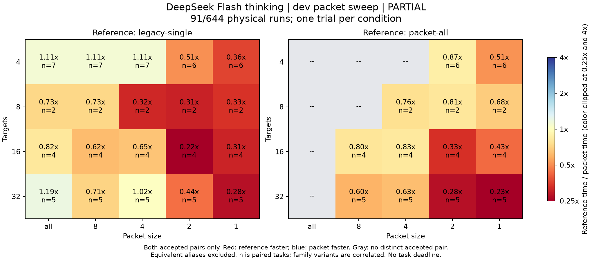

# 修正版packet粒度比較: dev-v2の途中結果

2026-09-11。「修正し、やり直して」に基づき、通知/read閉包の修正を含む`5104ad3`で新しい系列を実行した。**旧kernel不具合は再発せず、有効90runは全て成功した。91run目のHTTP 500で使用量不明が生じたため、系列は途中停止した。** 全128課題の比較は未完了。

## 実行と停止

[固定条件](../packet-sweep-rerun-plan.md): opencode-go/deepseek-flash、thinking有効、上位0、全target起動、packet C4上限、task間逐次、task締切なし。旧Singleと共通executorのall/8/4/2/1を各1回。同値の実分割は1回だけ実行する。旧系列の結果は流用せず、公開/非公開の凍結hashとdev128件のpreflightを再確認した。

- 実行したのは91/644実run。うち90件が証拠の揃った成功、1件が通信/usageの基盤障害。未開始553run。
- 観測18課題、6family。17課題では全6条件が揃った。apportionとtopkは未観測。evaluationとManagerは実行していない。
- 実call 526、上位0。**既知token下限6,459,555、使用量不明1call、総tokens・実請求額は不明。** 方式表の共有観測を重複計上していない。
- 準備159.38秒、runner所要時間の合計3,118.97秒、独立監査の合計83.92秒。準備と独立監査はrunner時間と別計上。失敗のelapsedを成功時completionへ代入しない。
- 最後のcallも精算処理が終わり、active reservationは0。unknown usageを残したbudgetはlocked、系列はevidence-stop、inFlightはnull、runner lockは削除済み。launcherも終了し、自動再送はしていない。

停止箇所は`units-v02 / packet-2 / call-2`。44.46秒後にHTTP 500と`Internal server error`が返り、model identityとusageは返らなかった。通信timeoutではない。call-1の2,312tokensは独立に照合し、call-2を0tokensとして扱っていない。保存された候補は独立oracleを通ったが、基盤/usageの証拠が欠けるこのrunは品質・速度の比較から除外する。

raw: `.sheep/packet-sweep/dev-v2/`。profile SHA-256: `4e7cefd595dab48ded3fffabe13296c7b30de5a8eff2a90bec0695f0b882c35d`。[全集計](packet-sweep-dev-v2.md)、[JSON](packet-sweep-dev-v2.json)、[通信障害のraw receipt監査](packet-sweep-dev-v2-failed-receipt-audit.json)。旧系列とその中断会計は保持している。

## 修正の実モデル確認

前回止まった`stats-v11 / packet-4`は、実DeepSeekで8call・40.11秒・120,938tokensで成功し、独立oracleも通った。同じ32target課題の全6条件も成功。今回の有効runに`kernel-infrastructure`はない。これは修正した実行経路がこの測定範囲で機能した証拠であり、任意repositoryの依存を完全に扱えるという主張ではない。

## 粒度について分かった範囲

旧Singleとpacket-allは18組とも成功し、速度の勝敗は9対9、対応した`Single / packet-all`時間比中央値は1.03。旧Singleと共通packet executorには入力・検査経路の違いがあるため、次の表では同じexecutorのpacket-allを参照する。

| 分割条件 | 有効な異なる分割の組 | 同値のため除外 | allが速い | 分割が速い | all / 分割 時間比中央値 |
| --- | ---: | ---: | ---: | ---: | ---: |
| packet-8 | 9 | 9 | 8 | 1 | 0.679 |
| packet-4 | 11 | 7 | 8 | 3 | 0.628 |
| packet-2 | 17 | 0 | 15 | 2 | 0.441 |
| packet-1 | 17 | 0 | 15 | 2 | 0.375 |

1未満ならallが速い。同値条件は別試行や引分けに数えていない。**この途中標本では、一括処理が分割より速い組が多い。** 32targetの5課題でも、packet-allが全ての分割条件を上回った。一方で分割が勝つ課題もあり、この18課題から最適粒度や品質同等を確定しない。

色は参照時間/比較先時間の比。赤は参照の方が速く、青はpacketの方が速い。nは同じ課題で両方式が成功した組数。4targetのall/8/4は同じ実行を共有する。右図の灰色は独立した比較がないセルで、成功0を意味しない。

観測した品質失敗は0だが、family内variantは相関し、2familyは未観測である。1課題1試行なので実行順、cache、providerの変動を除き切れない。適応的な粒度選択の優位、一般的なコード修正、evaluationの成績へは拡張しない。

## 検証

各完了runでraw usage・model/thinking・配信baseline/現在版overlay・kernel checkout・候補・元fixture不変・独立公開/hidden検査を照合した。終了後に全90有効runを再監査し、障害runのreceiptも別に会計確認した。追加の実モデル呼出しはしていない。

solverは修正時に型検査・574テスト・参照snapshot2件を通った同じ内容で、実走中のhashを固定した。この変更では結果と現行文書を更新し、report生成時の固定計画リンクを選べるようにした。report生成・構文確認・図の目視・`git diff --check`で検証した。
