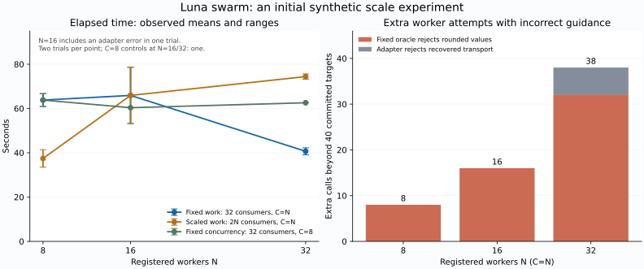

# 8・16・32体の初期観測

2026-09-10 JST。[条件](scaling-protocol.md)、[集計JSON](scaling-v1.json)。主比較15runと、その前の16体pilotを保存した。主比較は全runで最終受入を通過した。下位は全てLuna、上位はAstra。runtimeを固定して実行し、後から見つけたadapterの不具合を結果から取り除いてはいない。

## 人数と同時実行数

同じ40対象（consumer32＋report8）を処理する場合、各2試行の平均はN8/C8で63.79秒、N16/C16で65.90秒、N32/C32で40.65秒だった。N16の一方には回復済み通信の誤分類による再試行が含まれる。もう一方にもLunaが余分な出力フィールドを返した受入拒否が1件あり、成功した試行だけへ絞り直していない。

C=8を固定すると、N8が60.87–66.72秒、N16が60.36秒、N32が62.58秒だった。追加対照は各1回なので小さな差を評価できないが、個体数だけの増加で速くなる証拠は得られていない。

仕事量を2N consumerへ増やした場合、N8/C8の20対象は33.47–41.40秒、N32/C32の80対象は73.20–75.60秒だった。仕事量4倍を同じ時間で処理できるほどの伸びはない。モデル応答、各waveの待ち合わせ、直列化した受入・確定を含む測定であり、ボトルネックを全て群れの調整へ帰属できない。

通常の40対象で、N8の担当は各5回、N32は各1–2回だった。個体別の記憶は実際に再利用されたが、担当の平準化と近傍選択はhostが実装した規則である。自然な意味的専門化や、記憶が性能を改善したことまでは示していない。

## 誤指示が増員でどう広がったか

| N=C | 丸め指示による受入拒否 | adapterによる余分な再試行 | 下位呼出し | 上位呼出し / 実際の仕様変更 | 全入出力token |
|---:|---:|---:|---:|---:|---:|
| 8 | 8 | 0 | 48 | 1 / 1 | 966,130 |
| 16 | 16 | 0 | 56 | 1 / 1 | 1,123,458 |
| 32 | 32 | 6 | 78 | 2 / 1 | 1,577,368 |

wave終了時に上位を起動するため、最初のN体が同じ誤指示へ進んだ。増員は同時に進む仕事と、訂正前に浪費する仕事の両方を増やした。上位による仕様変更は各規模で1回で済んだが、N32では後述するadapterの誤分類に対して追加の上位観測が発生した。

丸めた候補は外側oracleが拒否し、共有artifactへ確定しなかった。N32の32拒否候補は全てvalidation不合格、committedRevisionなし、確定trace・完了receiptへの参照なし。誤ったコードが一度確定されてから戻された結果ではない。誤りは共有指示と候補作成の段階で波及し、採点境界で止まった。

## adapterの不具合と費用の再集計

N16通常2回目の4呼出しとN32誤指示条件の6呼出しは、WebSocketの接続エラー後にHTTPSへ切り替わり、実際にはexit 0とturn.completed、schemaに適合する出力、usageを返していた。凍結版adapterは途中のerrorイベントだけで失敗と判断した。

この10呼出しの生出力を凍結oracleで局所検証すると全てpassし、誤分類のため候補登録まで進めなかったことを確認した。N16の不要な上位noopは21,785token、N32は22,024tokenを使った。費用上の不利を消すためにこれらを差し引いてはいない。

元のresult.jsonは変更せず、生transcriptから欠落した195,774tokenを復元した。集計JSONのusageRestorationsに呼出ID・復元量・生レシートのSHA256を残す。復元後に使用量が不明の呼出しは0。したがって表は推定価格や局所prompt量ではなく、CLIの付帯contextも含む観測tokenである。

現行adapterは、後続の成功terminalイベントを伴う回復済み通信を受理する。後続の失敗、非0終了、不正schema、モデル不一致は引き続き拒否する。さらに現行runnerは通信失敗だけで仕様を修正する上位を起動しない。この修正後の性能を、ここにある凍結版の値で主張することはしない。

## 今回の判断

局所提案・固定受入・必要時の共有仕様変更で、32体まで作業を収束させる基盤は動いた。一方、現時点の測定は並列作業の成立を示すもので、創発や費用優位の証明ではない。

次に価値があるのは、共有する前提が途中で変わる課題で、wave全体を待つ方式と失敗を早く観測する方式を比較すること。個体数とCを分け、記憶なし・近傍選択なしの対照も必要になる。これらは今回の初期比較の後に行う検証として残す。
