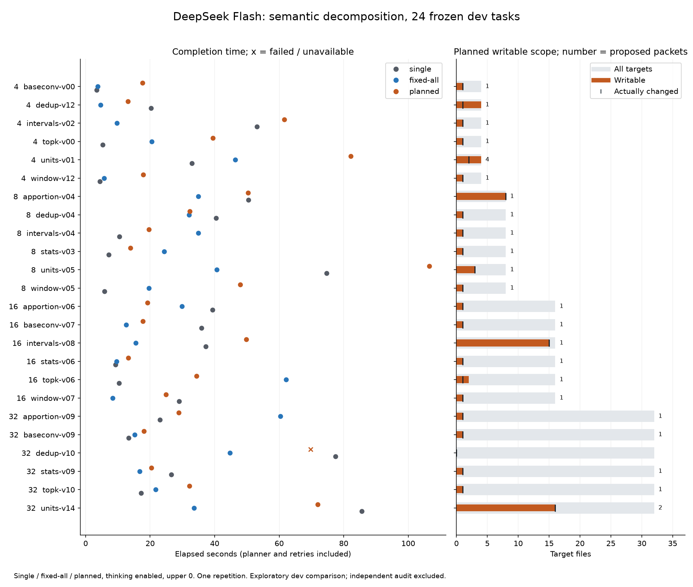

# Semantic decomposition: 分割しない判断と、その追加費用

24課題×3方式を完了し、101callのreceipt・候補・元fixture・固定受入を監査した。このdev課題群では、独立したplanner callを常設する根拠は得られなかった。Singleとpacket-allを基準に保ち、`--plan-work`は実験用opt-inとする。

| 方式 | 受入成功 | 成功時の時間中央値 | 総tokens | call |
| --- | ---: | ---: | ---: | ---: |
| Single | 24/24 | 24.82秒 | 372,462 | 25 |
| 固定packet-all | 24/24 | 21.10秒 | 362,442 | 24 |
| Planned packet | 23/24 | 28.91秒 | 537,601 | 52 |

DeepSeek Flash、thinking有効、上位0。dev8 familyから公開metadataだけで各3件を選び、4/8/16/32targetを各6課題とした。全6通りの実行順を均等に使い、task間逐次、worker最大C4、plannerを含む共有予算、task締切なしで測った。途中でsolver・課題・採点条件を変更していない。

両方成功した23組では、plannedはSingleに8勝15敗、固定allに5勝18敗。planned/対照の時間比中央値はSingle比 **1.36倍**、固定all比 **1.48倍**だった。上表の方式別中央値の割算とは異なる、同じ課題同士の時間比である。

## 何を選んだか

有効23planのうち **21件が1packet**、1件が2packet、1件が4packetだった。1packetのうち全targetを担当したのは2件。16件は1targetだけを担当した。有効planの担当数・実変更数の中央値はともに1targetだった。

したがって、モデルが「分割しない」と判断できることは確認できた。ただし大半は対象を絞った一人のworkerであり、最初のcallで修正を完了するSingleとは異なる。plannerを別callにする負担が残る。

複数packetを選んだのはunitsの2課題だった。4targetでは4packet、最大2callの並列実行で成功したが、planner込み82.20秒、Single32.92秒、固定all46.34秒。32targetでは16targetを2packetに分けて71.97秒、Single85.62秒、固定all33.61秒だった。固定allに勝った複数packetの例はなかった。

## 追加callの負担

有効planのplanner API call時間中央値は24.31秒。全24planner callだけで360,086tokensを使い、固定all全24条件の362,442tokensに近い。plannedのworker部分は177,515tokensだが、合算では537,601tokensとなった。

検証command数はSingle384、固定all744、planned139で、plannedは担当削減によってruntime側の検証回数を減らした。それでも今回の完了時間では追加planner callを補えなかった。各方式384commandの独立再検査は別計測。command時間や並列call時間の合計をwall timeとして扱わない。

4targetの6課題は固定allが全勝し、planned/固定allの時間比中央値は2.98倍。32targetでも両方成功した5課題中4課題で固定allが速く、同時間比中央値は1.22倍。小さい課題ほど追加callの負担が目立つが、各サイズ6課題・各方式1回の探索的結果である。

## 失敗の分類

失敗はplannedの`syn-dedup-v10`の1件。plannerは正常に終了したJSONへ契約外の`rationale_note_unused`フィールドを追加し、厳密なschema検査で拒否された。workerは起動していない。HTTP 200、usageは完全であり、通信障害でもhidden oracleでのコード不合格でもない。

保存済み出力のコピーから余分なtop-levelフィールドを除く後検証では、1packet・2target担当のplanとして範囲と依存の検査を通った。workerを追加実行しておらず、修正成功は未確認。元の失敗と消費を保持し、成功数を繰り上げていない。これを意味的な分解能力の失敗だけで説明することはできない。一方、1planner callで不正出力を終端とする今回の方式の受入失敗には数える。

## 採用判断と次の境界

- 既定経路を独立planner付きへ変更しない。Single／packet-allを基準とし、追加plannerは実験経路に置く。
- 固定細分化やC増加を次の主実験にしない。「分割しない」選択は機能したが、この課題群での速度優位は確認できなかった。
- 次の分解実験には、複数の独立した変更を本当に必要とする課題や、利用者が変更起点を公開している変更伝播課題を使う。既知devの不具合位置metadataをhintへ転用しない。
- 「最初の実装callが直接修正するか分割を要求するか選ぶ」方式は、常設plannerの負担を避ける別仮説として残す。今回の実装・実測には含まない。

この比較は入力選択と分割を含む方式比較であり、分割だけの因果効果ではない。一般repo・大規模開発・Swarm全般の否定には広げない。evaluationとManagerは今回実行していない。

## 再現と証拠

[設計・固定条件](../semantic-decomposition.md)、[全行と集計](semantic-decomposition-dev.md)、[JSON](semantic-decomposition-dev.json)、[SVG](semantic-decomposition-dev.svg)。実装revisionは`4b3b00a713ae47e8f3cc52ca65ec483419111414`、profile hashは`e603bd3d0aae66685547eba8c08fa57b4f1e365bebf2af8bac7b7a0879c2ed90`。

全72試行で通信再試行0、不明usage0、1,272,505tokens。全条件の実行時間合計2,223.56秒、独立監査67.11秒、事前検査・凍結36.92秒。人間の実作業時間と請求額は未測定。通常gateは593 tests・型検査・参照2件が成功。実測中に重いtestを重ねていない。

    node scripts/report-semantic-decomposition.mjs .sheep/semantic-decomposition/dev-v1 docs/results/semantic-decomposition-dev
    python3 scripts/plot-semantic-decomposition.py docs/results/semantic-decomposition-dev.json docs/results/semantic-decomposition-dev

図の再生成にはMatplotlibを導入したPythonを使う。

raw plan、host正規化、planner/worker receipts、read/version、budget、候補、固定oracleは`.sheep/semantic-decomposition/dev-v1`に保存した。公開JSONには凍結runtime hash、reporter/plotter hash、各row/result/candidate/独立検査のhashを残す。
