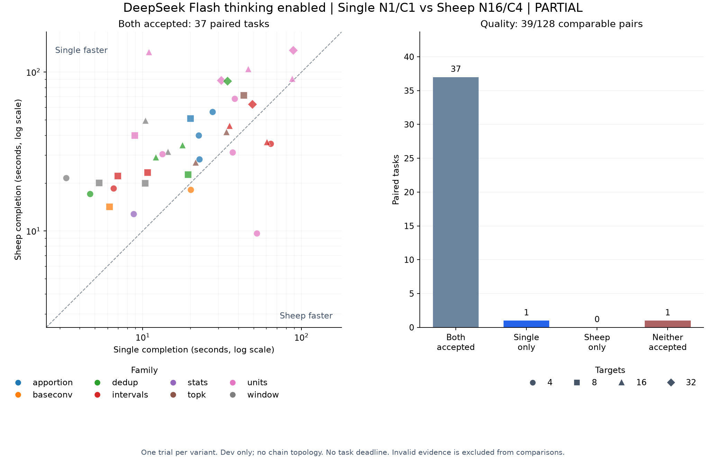

# dev合成課題のSingle/Sheep対応比較

状態: **未完了**。80/256 run、証拠が揃った比較は39/128組。停止理由: evidence-stop。

[事前計画](../execplan-synthetic-paired.md)に従い、PR #8の全256件の公開/非公開hashを凍結した。今回の対象はdev 128件のみ。evaluationの追加呼出しやManagerの呼出しは含まない。

## 固定条件

- `opencode-go/deepseek-flash`、thinking enabled、上位0、toolなし。Single N1/C1・名前付き全file提案、Sheep N16/C4・1target提案・全target起動。
- 同じrepository・公開契約/check・write範囲・最終oracleを使用。公開情報へのアクセス範囲は共通だが、初期context、提案、検証、再試行の粒度は方式に含まれる。
- 各課題/方式で128call、総2,000,000tokens、予約200,000tokens/call、出力64,000tokens/call。task締切なし。通信timeout600秒は採点の制限時間ではない。
- 課題順をhashで固定し、同じ課題の両方式を隣接実行。各familyで先攻8/8、課題間の並列実行なし。各課題は方式ごとに1回。
- 完了時間はrunner開始から最終検査を含む返却まで。成功時のみcompletionを記録。準備と独立監査を別計上。

## 観測

対応が揃った39組ではSingle 38/39成功、Sheep 37/39成功。両方成功37組、Singleのみ1組、Sheepのみ0組、両方失敗1組。

有効なrun全体ではSingle 39/40成功、Sheep 37/39成功。こちらには片側だけ結果が揃った課題も含む。

証拠/基盤の異常がある1 runは品質・速度の対応比較から除外し、未確定として扱う。消費したcall/tokenや停止記録は資源表とJSONへ残す。

両方成功した同じ課題ではSheepが速い5組、Singleが速い32組。速度比Single/Sheepの中央値は0.513（1より大きいとSheepが速い）。差Single−Sheepの中央値は-14.80秒。成功集合が異なる方式別中央値を速度差として比較しない。



| 方式 | call | 既知tokens | 総tokens | 成功時完了中央値 秒 | 全run経過時間計 秒 |
| --- | ---: | ---: | ---: | ---: | ---: |
| single | 42 | 498,277 | 498,277 | 20.01 | 1091.64 |
| sheep | 444 | 2,853,335 | 不明 | 34.65 | 1811.84 |

系列の既知tokensは3,351,612、総tokensは不明。準備149.40秒、独立監査計51.97秒。reasoningは出力tokenの内数で二重加算しない。実請求額と作成人手時間は不明。未確定callがあれば既知tokensを全消費量とみなさない。

## family別

| 条件 | 完了組/予定組 | Single成功/run | Sheep成功/run | 両方成功 | Singleのみ成功 | Sheepのみ成功 | 両方失敗 | 速度比中央値 |
| --- | ---: | ---: | ---: | ---: | ---: | ---: | ---: | ---: |
| apportion | 4/16 | 4/4 | 4/4 | 4 | 0 | 0 | 0 | 0.527 |
| baseconv | 4/16 | 3/4 | 2/4 | 2 | 1 | 0 | 1 | 0.768 |
| dedup | 5/16 | 5/5 | 5/5 | 5 | 0 | 0 | 0 | 0.413 |
| intervals | 7/16 | 8/8 | 7/7 | 7 | 0 | 0 | 0 | 0.766 |
| stats | 1/16 | 1/1 | 1/1 | 1 | 0 | 0 | 0 | 0.685 |
| topk | 3/16 | 3/3 | 3/3 | 3 | 0 | 0 | 0 | 0.798 |
| units | 10/16 | 10/10 | 10/10 | 10 | 0 | 0 | 0 | 0.500 |
| window | 5/16 | 5/5 | 5/5 | 5 | 0 | 0 | 0 | 0.263 |

## target数別

| 条件 | 完了組/予定組 | Single成功/run | Sheep成功/run | 両方成功 | Singleのみ成功 | Sheepのみ成功 | 両方失敗 | 速度比中央値 |
| --- | ---: | ---: | ---: | ---: | ---: | ---: | ---: | ---: |
| 4 | 14/46 | 15/15 | 13/14 | 13 | 1 | 0 | 0 | 0.564 |
| 8 | 10/32 | 9/10 | 9/10 | 9 | 0 | 0 | 1 | 0.433 |
| 16 | 11/25 | 11/11 | 11/11 | 11 | 0 | 0 | 0 | 0.513 |
| 32 | 4/25 | 4/4 | 4/4 | 4 | 0 | 0 | 0 | 0.516 |

## topology名別

| 条件 | 完了組/予定組 | Single成功/run | Sheep成功/run | 両方成功 | Singleのみ成功 | Sheepのみ成功 | 両方失敗 | 速度比中央値 |
| --- | ---: | ---: | ---: | ---: | ---: | ---: | ---: | ---: |
| diamond | 3/19 | 3/3 | 3/3 | 3 | 0 | 0 | 0 | 0.442 |
| fanin | 10/30 | 9/10 | 8/10 | 8 | 1 | 0 | 1 | 0.745 |
| fanout | 6/14 | 6/6 | 6/6 | 6 | 0 | 0 | 0 | 0.287 |
| independent | 14/46 | 15/15 | 14/14 | 14 | 0 | 0 | 0 | 0.445 |
| sparse | 6/19 | 6/6 | 6/6 | 6 | 0 | 0 | 0 | 0.783 |

## 実際の依存深さ別

| 条件 | 完了組/予定組 | Single成功/run | Sheep成功/run | 両方成功 | Singleのみ成功 | Sheepのみ成功 | 両方失敗 | 速度比中央値 |
| --- | ---: | ---: | ---: | ---: | ---: | ---: | ---: | ---: |
| 1 | 15/40 | 14/15 | 13/15 | 13 | 1 | 0 | 1 | 0.685 |
| 2 | 6/29 | 6/6 | 6/6 | 6 | 0 | 0 | 0 | 0.323 |
| 3 | 18/59 | 19/19 | 18/18 | 18 | 0 | 0 | 0 | 0.537 |

## 未受入のrun

| 課題 | 方式 | target数 | elapsed 秒 | call | 終了分類 |
| --- | --- | ---: | ---: | ---: | --- |
| syn-baseconv-v01 | sheep | 4 | 41.03 | 4 | sheep-not-accepted |
| syn-baseconv-v04 | single | 8 | 34.70 | 1 | holdout-failed |
| syn-baseconv-v04 | sheep | 8 | 57.79 | 8 | sheep-not-accepted |
| syn-intervals-v12 | sheep | 4 | 38.18 | 3 | 証拠/基盤停止 |

品質の不合格は候補を保存して次へ進む。hiddenの失敗内容を修正callへ戻していない。実行基盤や証拠の異常による停止と、意味上の不合格を区別する。

停止したsyn-intervals-v12/sheepではunknown usage 1 call、既知の消費下限4,986tokens、active reservation 0。応答HTTP statusは200/200/500。使用量やモデル識別が欠けたcallを0消費とみなさず、系列はlockしたままにする。

未実行は176 run。未確定の片側結果がある組も含め、全128組の比較は未完了である。

## 解釈の限界

devは8系統内の128 variantで、独立した128種類の実務課題ではない。target数とtopologyは非直交。devの宣言依存深さは1〜3段で、chainは0件。evaluationにはchainが24件あり最大31段なので、分割にはfamilyだけでなく依存構造の分布差もある。devから深いchainへの外挿はできない。方式の速度比は両方成功した集合に条件づけられている。APIの時刻変動・cache・実行環境の影響を完全には除けない。

PR #8でevaluationのvariant 0を8件観測済みなので、evaluationを完全未見とは呼ばない。今回のdev結果から設定を固定するまでevaluationを追加実行しない。Managerや新しいrecovery機構の優位もこの系列では検証していない。

元コードから編集されたtarget数を実行開始後の探索的分析としてJSONに収録する。既知不具合のないtargetを編集した数は意味上の回帰数ではない。作者側の不具合metadataはこのhost集計だけで使い、solverへの入力には使っていない。

## 検証と再現

通常gateは555テスト成功、参照snapshot2件一致。全256課題のhash一致、dev 128件の元コード・基準解・意味変異のpreflightを確認した。独立監査はAPI raw usageとbudget、モデル・thinking、公開context、元repo不変、候補hash、独立受入、予定順序を照合する。

```sh
node scripts/synthetic-paired-benchmark.mjs audit .sheep/synthetic-paired/dev-v1
node scripts/report-synthetic-paired.mjs .sheep/synthetic-paired/dev-v1 docs/results/synthetic-paired-dev
```

図はMatplotlibで生成する。任意の隔離Python環境へ`experiments/synthetic-paired-plot-requirements.txt`を入れ、`python scripts/plot-synthetic-paired.py docs/results/synthetic-paired-dev.json docs/results/synthetic-paired-dev`でPNG/SVGを出力する。描画依存はbenchmark runtimeへ追加していない。

[固定profile・全観測行・交差集計・探索的編集数](synthetic-paired-dev.json)。raw記録はignoredの`.sheep/synthetic-paired/dev-v1/`へ保存。途中のrunを再送して欠測や費用不明を隠さない。
